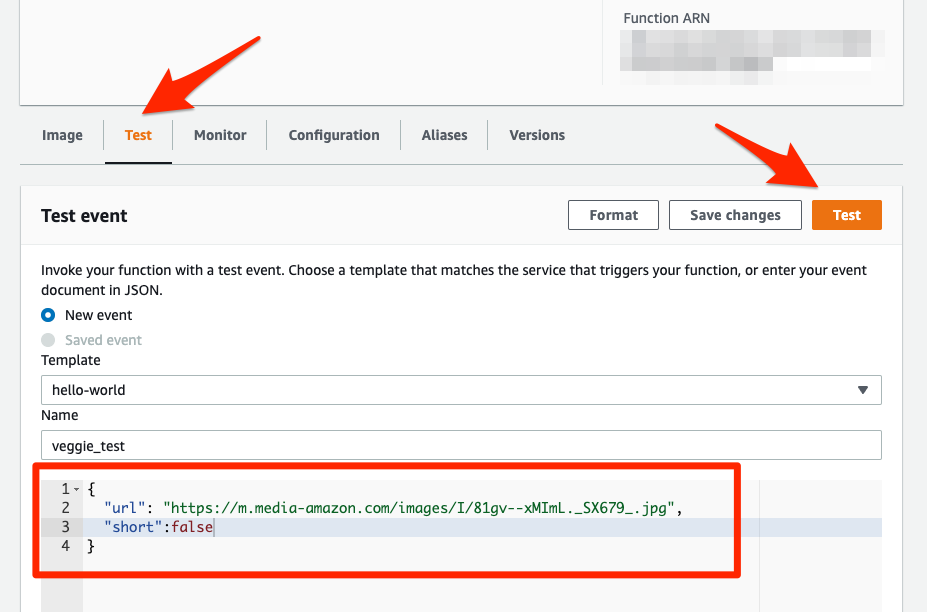

This folder contains all the required code for the [capstone project of Alexey Grigorev's ML Zoomcamp](https://github.com/alexeygrigorev/mlbookcamp-code/tree/master/course-zoomcamp/12-capstone).

# Dataset Description

_Original dataset [found here](https://www.kaggle.com/kritikseth/fruit-and-vegetable-image-recognition)_

This dataset contains images of the following food items:

* Fruits: banana, apple, pear, grapes, orange, kiwi, watermelon, pomegranate, pineapple, mango.
* Vegetables: cucumber, carrot, capsicum, onion, potato, lemon, tomato, raddish, beetroot, cabbage, lettuce, spinach, soy bean, cauliflower, bell pepper, chilli pepper, turnip, corn, sweetcorn, sweet potato, paprika, jalepeño, ginger, garlic, peas, eggplant.

This dataset contains three folders:

* train (100 images each)
* test (10 images each)
* validation (10 images each)

Each of the above folders contains subfolders for different fruits and vegetables wherein the images for respective food items are present.

# Project Description

For the capstone project I decided to work on a project involving Deep Learning. I opted for a simple ***image classification task*** due to time constraints and inexperience.

This is a simple dataset containing 36 different classes of fruits and vegetables. The dataset is very small, which makes training a network from scratch unfeasible. Thus, the project relies exclusively on Transfer Learning for image feature extraction.

3 different convolutional architectures were used:

* `Xception`: one of the most popular architectures available on Keras.
* `MobileNet_v2`: a very lean and efficient architecture with excellent performance to model size ratio.
* `NasNetLarge`: One of the largest models available on Keras besides `VGG`. Chosen for its large size but excellent accuracy as listed on the [Keras Applications website](https://keras.io/api/applications/).

# Files

* `notebook.ipynb`: main Jupyter Notebook where all EDA and model training is carried out.

* `environments` is a folder with all of the environment management files (see [Environment setup](#environment-setup) below):
    * `conda-environment.yml` is a YAML file for creating an environment with Conda.
    * `conda-requirements.txt` is a TXT file for installing all required dependencies in Conda format.
    * `pip-requirement.txt` is a TXT file for installing all required dependencies in pip format.

* `train.py` is an exported version of the training code found in `notebook.ipyn` that allows the creation and "liteization" of a model using the final chosen architecture without having to run all the code blocks in the Jupyter Notebook.

* `lambda-function.py` contains the inference code for predictions. The script is formatted for deployment on Amazon Web Services' Lambda.

* `docker` is a folder that contains all of the necessary components for dockerization and deployment (see below on the [Docker](#docker) and [Deployment](#deployment) sections):
    * `Dockerfile` is the file necessary to create the Docker image.
    * `lambda-function.py` is a copy of the same file on the root project folder except for a changed library for deployment.
    * The folder should also contain `model.tflite`; the actual model file that is needed for predictions.

* `models` contains all the models that have been trained in case you don't want or can't retrain them (hyperparameter tuning is particularly time intensive). These files have been uploaded to [Git LFS](https://git-lfs.github.com/).

You will also need the dataset. The original dataset can be downloaded from Kaggle [in this link](https://www.kaggle.com/kritikseth/fruit-and-vegetable-image-recognition). Please unzip it in the project folder and make sure that the final folder structure is as follows:

    /12_project
        /data
            /test
            /train
            /validation

The code assumes that the dataset will be set up like this. Otherwise, it will fail. Some part of the code also make use of additional images that I manually downloaded. For convenience, I'm hosting the dataset and the additional images on Dropbox in this link.

https://www.dropbox.com/s/ynl1h8e4zf4sqj2/data.zip?dl=0

Download and unzip the file inside the project's root folder. It should maintain the folder structure mentioned above.

# Environment setup

The Jupyter Notebook and Python scripts were all tested on Ubuntu 20.04 Intel x64.

## Pip

You may install all dependencies with `pip` with the following command:

`pip install -r pip-requirements.txt`

> Note: `pip-requirements.txt` was created with the following command:

> `pip list --format=freeze > pip-requirements.txt`

## Conda

2 alternative methods are provided:

1. Create an environment named `tf` with the provided `conda-environment.yml` file:

    * `conda env create -f environments/conda-environment.yml`
    * You can change the name of the environment by modifying the first line of the `conda-environment.yml` file. Modify and save the file before creating the environment!

1. Create an environment with a name of your choosing with all the dependencies listed in `conda-requirements.txt`:
    * `conda create --name <env_name> --file environments/conda-requirements.txt`
    * `<env_name>` may be any name you choose.

> Note: `conda-environment.yml` was created with the following command:

> `conda env export --from-history > conda-environment.yml`

> `conda-requirements.txt` was created with the following command:

> `conda list -e > conda-requirements.txt`

# Main notebook

The `notebook.ipynb` file contains all the Exploratory Data Analysis as well as all of the model training.

## Exploratory Data Analysis

Because the dataset contains images, the EDA is limited to class distribution to check for imbalances, random sample visualization and image size distribution.

## Model training

3 architectures were chosen for Transfer Learning:
* `Xception` because it's one of the most popular models.
* `MobileNet_v2` because it's a very small and efficient model.
* `NasNetLarge` because it's a large model with supposedly increase accuracy (according to the [Keras Applications website](https://keras.io/api/applications/)).

## Hyperparameter search and tuning

The 3 architectures listed above are used for image feature extraction, but the final dense layers in charge of classification are build from scratch.

The `keras-tuner` framework is used for finding the best dense layer architecture. The framework test from 1 to 4 additional dense layers (besides the final output layer) with a number of neurons ranging from 32 to 256 per layer. The tuner also looks for the optimal learning rate. Once the optimal architecture is found, a final model is retrained using the chosen hyperparameters.

## Tensorboard

Both the hyperparameter search and final model training generate logs that can be viewed on Tensordoard.

There are code blocks for inline loading of Tensorboard inside `notebook.ipynb` but they're untested and may not work. Due to my setup, I had to run Tensorboard from the terminal, which is how I recommend doing it.

Before running Tensorboard, please be advised that the log paths are hardcoded in the notebook. Logs will be stored to separate folders inside `/tmp`. If you'd like to change these locations, you will have to alter the code manually and change the paths.

To run Tensorboard, simply call it in a terminal and point to the log folder location, like this:

    tensorboard --logdir /tmp/tb_mn_final --bind_all

The `--bind_all` option is only necessary if you'd like to open Tensorboard from a browser in a machine other than the one that contains the logs. If you will only load Tensorboard on a local browser, you may omit the `--bind_all` option.

Once Tensorboard is running, simply open the dashboard in a web browser by typing the machine's URL:

    localhost:6006

If you're browsing from a machine other than _localhost_, then you will have to look up the machine's URL or IP address.

Please note that the Tensorboard logs for the hyperparameter search are quite big and will be difficult to load in a browser on a computer with little RAM available.
## Code export

The final model training code has been exported to `train.py`. Simply running `python train.py` from a terminal will create and save a final model in both `h5` and `tflite` formats for easier deployment.

The `lambda-function.py` script is also provided for inference. The script is intended for deployment using Amazon Web Services' Lambda. An additional `test.ipynb` notebook is provided for testing the lambda script, both locally and in containerized form.

# Docker

The `docker` folder contains all of the necessary files to create a Docker image that can run a containerized version of the final model for deployment using Amazon Web Services' Lambda. 

Before creating the Docker image, make sure that the `Dockerfile`, `model.tflite` and `lambda-function.py` files are all inside the folder. Then, from a terminal, in the `docker` folder run the following command:

`docker build -f Dockerfile -t veggies-lambda .`

Please note the period at the end of the command. You may change `veggies-lambda` to any other name.

> Note: running `docker build` from the root folder may cause the final image to work improperly.

Once the image has been created, run it with the following command:

`docker run -it --rm -p 8080:8080 veggies-lambda:latest`

The `test.ipynb` Jupyter Notebook is provided in the project root folder for testing the `lambda-function.py` script. The notebook allows you to test the script locally/directly or test the containerized version in Docker.

There are 2 copies of `lambda-function.py` for convenience: one copy is in the root folder and another one is inside the `docker` folder. The only difference between them is that the version in the root folder imports `tensorflow.tflite` and the one inside `docker` imports  `tflite_runtime` for containerization. 

# Deployment

You may deploy the model to AWS Lambda by following these steps:

1. [Install and set up AWS CLI](https://docs.aws.amazon.com/cli/latest/userguide/getting-started-prereqs.html).
2. [Create a repository in ECR and upload the Docker image](https://docs.aws.amazon.com/AmazonECR/latest/userguide/getting-started-cli.html).
    1. Create a registry on ECR with AWS CLI:
        * `aws ecr create-repository --repository-name <registry-name>`
        * Write down your `aws_account_login` (the first numbers in the output of the command above) and the `region` (the string right in front of `amazonaws.com`)
    1. Authenticate to your registry:
        * `aws ecr get-login-password --region <region> | docker login --username AWS --password-stdin <aws_account_id>.dkr.ecr.<region>.amazonaws.com`
        * Change `<region>` and `<aws_account_id>` to the values you got in the previous step.
    1. Create a _remote URI_ for the image.
        * Create the remote URI by appending to the URI from the output of the `aws ecr create-repository` command a semicolon (`:`) and a tag of your choosing.
            * Example: `123456.dkr.ecr.eu-west-1.amazonaws.com/my-registry:veggie-tflite-001`
    1. Tag the Docker image with the remote URI:
        * `docker tag veggies-lambda:latest <remote_URI>`
            * Using our remote URI example, the command would be `docker tag veggies-lambda:latest 123456.dkr.ecr.eu-west-1.amazonaws.com/my-registry:veggie-tflite-001`
        * Remember to change `veggies-lambda` to whatever name you chose when creating the image.
    1. Push the image to Amazon ECR
        * `docker push <remote_URI>`
            * Using our remote URI example: `docker push 123456.dkr.ecr.eu-west-1.amazonaws.com/my-registry:veggie-tflite-001`
        * This may take a few minutes depending on your internet connection.
1. Set up a Lambda function.
    1. Open the Lambda dashboard on AWS and click on _Create function_.

    1. Choose _Container image_, give the function a name and click on _Browse images_ below _Container Image URI_.

    1. Click on the drop-down arrow to select your repository, select the image from your repository and click on _Select image_.

    1. Back on the _Create function_ page, click on _Create function_.

    1. Lambda will then create your function. It will take a few minutes. You should see a greeen banner on top once it's created.
    1. Click on the _Configuration_ tab and then click _Edit_ on _General configuration_.

    1. Change _Memory_ to `1024 MB` and _Timeout_ to `30 sec`.

    1. Test the function by clicking on _Test_, writing a JSON document and clicking on _Test_.
        * Note that JSON is much more strict in its syntax than a Python dictionary and Amazon will complain if you don't pay attention. The example in the image gives you an example that should return a successful reply from the container.

1. Create an _API gateway_ for the Lambda function.
    1. Got to the AWS API Gateway dashboard, choose _REST API_ and click on its _Build_ button.

    1. Make sure that the API protocol is set to _REST_, choose _New API_ and give the API a name in the _API name_ field.

    1. Create a new _resource_ by clicking on the _Actions_ button and clicking on _Create Resource_.

    1. Give your resource a name (this example will use `predict` as resource name) and click on _Create Resource_.

    1. Create a new _method_ for your resource by clicking on _Actions_ > _Create Method_.

    1. On the method's dropdown menu, choose _POST_, then click on the checkmark

    1. Finish the method set up by clicking on _Lambda Function_ under _Integration type_, and them in the _Lambda Function_ field type the name of your Lambda Function (the same name on step 3-2; the website will offer an autocomplete option as soon as your start typing the name). Click on Save when you're done, and then click on OK on the warning.

    1. Test the API by clicking on _TEST_ inside the _Client_ block.

    1. Write a JSON document for testing in the _Request Body_ field. You may use the same one from the Lambda function testing on step 3-8. Click on _Test_. You should get a successful response.

    1. Once you've finished testing, click on the _Actions_ button again and click on _Deploy API_ under _API Actions_.

    1. In the _Deploy API_ menu, select _[New Stage]_ in the _Deployment stage_ field and give it a name. This example will use `test`.

    1. Copy the _Invoke URL_ at the top of the Stage Editor screen. You may now save the changes and close this screen.

1. Test the deployment. The last section in the `test.ipynb` file is provided for testing the deployment.
    * My personal deployment should be available during the duration of the evaluation of the course, so the default URL provided in the `test.ipynb` file should work during that time.
    * ***WARNING***: any requests to a Lambda function cost money. It's not a good idea to leave the default settings of the API gateway because it can open the door to abuse.
