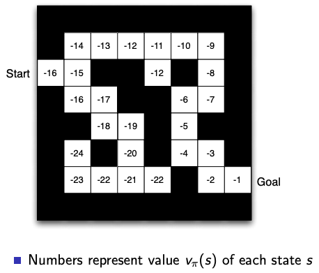

# Machine Learning refresher

## What is Machine Learning?

Back at the beginning of the ML Zoomcamp course, in [Lesson 1](../notes/01_intro.md), we saw an explanation of what **Machine Learning** (ML) is:

In the classic programming paradigm, the basic workflow is as follows:

```
data + rules = outcome
```

But ML shuffles things around into this:

```
data + outcome = model
```

So that we can do this:

```
data + model = outcome
```

This _model_ is a new set of rules that we can generate by means of statistics, calculus, algebra and several computer science techniques based on the available data. This is great because it allows us to generate very complex rules that would otherwise be extremely hard or time-consuming to define by regular human means.

However, what we've seen so far in the course is a sub-type of ML called _Supervised Learning_ (SL). A SL model learns a _mapping_ between _input examples_ and a _target variable_: we provide a bunch of data for which the outcome we want to calculate (the target varaible) is already known and the model figures out how to calculate those known outcomes with the hopes that it will do a good job of calculating new ones when we present the model with brand new data.

If you're wondering why this kind of ML is called _supervised_, it's because we "supervise" the learning by means of providing a ***ground truth*** in the form of ***labels*** (the known outcomes for the available data) so that our ML algorithm can compare the model's results with them and check how well it's performing.

However, SL is just one part of Machine Learning. What happens when we don't have labels? What can we do if our data is scarce? How do things like autonomous cars work?

## Beyond Supervised Learning

There are many different ML algorithms depending on the characteristics of the problem to solve and how we gather and process data. There are also a few different ways of classifying such algorithms.

[Yann LeCun](https://www.wikiwand.com/en/Yann_LeCun), one of the "Godfathers of Deep Learning", came up with his famous "cake analogy" to explain the different kinds of Machine Learning. According to his analogy, there are 2 main attributes in ML:

* How many samples you use for training
* How much info you get out of each sample

This results in the 3 different "branches" of ML that most people recognize:

* ***Reinforcement Learning***: the input samples are scarce and we get little info out of each sample.
    * E.g. teaching a robot to pick up an object. The data is limited to what we can detect around the robot and we need lots of tries in order to "predict" a simple action such as "crouch" or "open/close hand".
* ***Superviser Learning***: the input samples are bigger but costly (manually labeling data) and we predict categories or numbers for each input.
    * E.g. object classification in images, as we've already seen in [lesson 8 - deep learning](../notes/08_deep_learning.md).
* ***Unsupervised Learning***: the input samples are massive and unlabeled, and we make use of it to predict "everything".
    * E.g. predicting frames in a video. We make use of every pixel of each image for each output pixel.


>Note: _Self-supervised Learning_ is a sub-type of Unsupervised Learning. This slide is an updated 2019 version from the [original 2016 one](https://miro.medium.com/max/1400/0*sQmcKODThlssh2V5.png). The cake analogy was actually meant to explain how intelligence works and to emphasize the importance of Unsupervised Learning. You can learn more about it [in this link](https://medium.com/syncedreview/yann-lecun-cake-analogy-2-0-a361da560dae).

Another way of classifying ML algorithms is [Alex Graves](https://www.wikiwand.com/en/Alex_Graves_(computer_scientist))' "types of learning" table:

|   | With teacher | Without teacher |
| --- | --- | --- |
| **Active agent** | Reinforcement Learning / Active Learning | Intrinsic Motivation / Exploration |
| **Passive agent** | Supervised Learning | Unsupervised Learning |

>Source: https://youtu.be/3RVGrz7MjMg?t=24

* The **teacher** is the mechanism that lets the ML algorithm know that it's performing well, just like a school teacher would behave with a student. In the case of Supervised Learning, the labels are the teacher.
* The ***agent*** is the mechanism by which the ML algorithm receives and processes data.
    * Supervised Learning is a _passive agent_ (or _passive learning_) type of ML because we're directly feeding the data to the model in an ordered manner, like in the case of tabular data or image datasets.
    * An _active agent_ means that the algorithm must look for data on its own. If we're teaching a robot to pick up an object, the robot must actively generate its own data by observing its surroundings.

Both of these classification systems are valid and emphasize different aspects of ML. There are probaly other ways of classifying different ML algorithms and there even are approaches that can't be easily classified into the 3 main branches (Reinforcement Learning, Supervised Learning, Unsupervised Learning), such as meta learning.

In this article, I'd like to focus on Reinforcement Learning. I promise it won't hurt. _Not much_, at least.

# Introduction to Reinforcement Learning

## Understanding Reinforcement Learning

So, we've seen that Reinforcement Learning (RL) problems have an **active agent** that generates its own data and performs decisions, there's also a "**teacher**" that tells the agent how well it's performing and we also know that the data that the agent generates is limited and we need lots of samples for just one prediction. But what exactly is RL?

A definition of RL could be "a computational approach to goal-directed learning from interaction that does not rely on expert supervision"  _[[source]](https://mitpress.mit.edu/books/reinforcement-learning-second-edition)_. [Wikipedia](https://www.wikiwand.com/en/Reinforcement_learning) says that RL is "an area of ML concerned with how intelligent agents ought to take actions in an environment in order to maximize the notion of cumulative reward".

These 2 definitions are dense and kind of hard to understand without some prior knowledge. Let me explain RL with an example:

Let's suppose we want to teach a robot how to move through an obstacle course. The robot is the ***agent*** and the obstacle course is the ***environment***. Depending on where the robot is at the obstacle course and how well it's doing we can also define a ***state***; for example, the robot is at the beginning of the course standing up, the robot is halfway through but has tripped and it's currently laying down, or the robot has finished the course; these are 3 possible different states out of many more.

On any given state, the robot/agent can take an ***action***, such as stepping forward, jumping, standing up or even keeping still. The action will _change the state_ to a new one, which in turn will offer a new set of actions for the agent to take.

_Click on the image below to watch an example of what I just said._

[](https://www.youtube.com/watch?v=hx_bgoTF7bs)

Here's where the "teacher" part of RL comes in: after taking an action, the agent will receive both a new state and a ***reward***. The reward informs the agent about how good the previous action was. By defining a set of rewards based on the possible combinations of states and actions, we can teach the robot/agent to handle the obstacle course:
* Did the robot step forward and not fall down? Have a one point reward!
* Did the robot reach the goal? Excellent, 100 points!
* Did the robot trip on a hole and fall down? Oops, -5 points (a punishment!).
* Did the robot stand up? Good, 2 points! But if it tries to stand up and at the next state it's still laying down, -5 points again! Maybe the robot is stuck on a slippery surface?

By _maximizing the **total future reward**_ we teach the agent to take the optimal actions. And that's what RL is all about!

>Note: rewards may also be 0. Not every action equals a positive or negative reward; that's up to the environment.

Here's a cool little graph that explains the RL cycle:


>Source: [Wikipedia](https://www.wikiwand.com/en/Reinforcement_learning)

RL has a few differences from other ML paradigms:
* There is no supervisor, only a reward signal.
* Feedback is delayed, not instantaneous.
* Time matters; data is sequential.
* The agent's actions affects the subsequent data it receives.

## RL formalization

This is the part where it starts to get a little more complicated.

Formally, RL is formulated through a [_Markov Decision Process_](https://www.wikiwand.com/en/Markov_decision_process) (MDP). A MDP is a tuple <code>(𝑆 , 𝐴 , 𝑃<sub>𝑎</sub> , 𝑅<sub>𝑎</sub>)</code>:
* <code>𝑆</code> is the _state space_, the set of all possible environment and agent states. A single state is represented with lowercase <code>𝑠</code>.
* <code>𝐴</code> is the _action space_, the set of all actions that the agent can do. If the set of actions is only available from a specific state, we use <code>𝐴<sub>𝑠</sub></code>. A single action is represented with lowercase <code>𝑎</code>.
* <code>𝑃<sub>𝑎</sub></code> is the _probabilty density_ of the next state given the current state and action. More formally:
    * <code>𝑃<sub>𝑎</sub>(𝑠 , 𝑠') = 𝑃𝑟(𝑠<sub>𝑡+1</sub> = 𝑠' | 𝑠<sub>𝑡</sub> = 𝑠 , 𝑎<sub>𝑡</sub> = 𝑎)</code> is the probability that action <code>𝑎</code> in state <code>𝑠</code> at time <code>𝑡</code> will lead to state <code>𝑠'</code> at time <code>𝑡+1</code>.
* <code>𝑅<sub>𝑎</sub>(𝑠 , 𝑠')</code> is the _inmediate reward_ (or expected inmediate reward) received after transitioning from state <code>𝑠</code> to state <code>𝑠'</code> due to action <code>𝑎</code>.


>This image is an example of a Markov Chain. MDP's are extensions of Markov chains. Source: https://sanchit2843.medium.com/markov-chains-and-markov-decision-process-e91cda7fa8f2

An interesting property of MDPs is that they must satisfy the [Markov property](https://www.wikiwand.com/en/Markov_property): The future is _conditionally independent_ of the past. This is a property of _stochastic systems_: a random event does not depend on its past. But in RL we depend on the ***history*** (the sequence of observations, actions and rewards) to train our agent, so how do we handle the history if we cannot rely on the past for a MDP to be valid?

The solution lies in how we define the state. If we understand the state as a _function of the history_, we can codify all the relevant information from the history in the current state. Once we have that, we can throw away the complete history because the current state is a _sufficient statistic of the future_. The state is now a Markov state and using it in a MDP will satisfy the Markov property. Mathematically:
* A state <code>𝑠<sub>𝑡</sub></code> is Markov **if and only if**:
    * <code>𝑃(𝑠<sub>𝑡+1</sub> | 𝑠<sub>𝑡</sub>) = 𝑃(𝑠<sub>𝑡+1</sub> | 𝑠<sub>1</sub> , ... , 𝑠<sub>𝑡</sub>)</code>
    * The probability of state <code>𝑠<sub>𝑡+1</sub></code> given <code>𝑠<sub>𝑡</sub></code> equals the probability if <code>𝑠<sub>𝑡+1</sub></code> given all previous states.

An important distinction to make is that ***observation does not equal state***. Imagine a 3D camera navigating a labyrinth: the camera only sees a portion of the labyrinth, so it's impossible for the camera/agent to obtain the full _environment state_, which is a separate entity of the _agent state_. This is called a ***Partially Observable Environment***, and MDP that handle them are called ***Partially Observable Markov Decision Process*** (POMDP); we deal with them by constructing our own _state representation_ by different means (keeping track of the whole history, filling in the gaps with inference, etc.) so that our constructed state representation still maintains the Markov property.


## RL agent components

An RL agent may include one or more of these 3 components:

* **Policy**: the agent's behaviour function.
    * A _policy function_ <code>𝜋</code> maps states to actions.
* **Value function**: it tells us how good each state and/or action is.
    * A _value function_ predicts future rewards based on the current state and/or action, thus allowing us to evaluate how good or bad the current state/action is.
    * It can also be used to select between actions!
* **Model**: the agent's representation of the environment.
    * The _model_ predicts what the environment will do next.
    * It can predict both the next state and/or the next (inmediate) reward.
    * Do not confuse the RL model with the Supervised Learning model! In RL, the term "model" is used for modeling the environment; what we're actually training in RL is the agent!

Let's use an example environment to understand the components a little better:

Let our environment be a maze. The maze is a square grid with a start and a goal. The state is the agent's location in the maze, the actions are move up/down/left/right and the reward is -1 per step, so that the agent is motivated to reach the goal in as few steps as possible.


>Source: https://www.davidsilver.uk/wp-content/uploads/2020/03/intro_RL.pdf

A _policy_ <code>𝜋(𝑠)</code> would map a state `𝑠` to an action `𝑎`. The image below displays what the policy function would look like for each possible state.


>Source: https://www.davidsilver.uk/wp-content/uploads/2020/03/intro_RL.pdf

A _value function_ <code>𝑣<sub>𝜋</sub>(𝑠)</code> would calculate the estimated future reward based on the state `𝑠`:
* If we're on the cell right before the goal and a single step has a reward of -1, the value function will output -1.
* If we're 2 cells away from the goal, then the value function will be -2 because we will have to take 2 steps.
* And so on.

The image below displays the value function for all states.


>Source: https://www.davidsilver.uk/wp-content/uploads/2020/03/intro_RL.pdf

Finally, a _model_ would be a representation of the environment. The model may explain the _dynamics_ (how actions change the state) and the _rewards_ from each state. Depending on the nature of the environment, the model may be imperfect.


>Source: https://www.davidsilver.uk/wp-content/uploads/2020/03/intro_RL.pdf

Keep in mind the following caveats:

* An environment may be difficult or impossible to model accurately if it's complex enough.
* A complex environment may have so many possible states that makes using a policy or a value function on all of them unfeasible.
* Actions can be discreet (like the ones we've seen so far) or continuous (for example, "increasing speed up to X amount" rather than simply "step forward").

## RL "flavors" (taxonomy)

Based on the 3 components we've seen, we can categorize RL agents in different "flavors":

* Depending on whether the environment can be modeled, we can differentiate between ***model based RL*** and ***model free RL***.
    * _Model based_ RL example: learning to play chess.
    * _Model free_ RL example: learning to play Super Mario Bros.
* RL can be ***value based***, ***policy based*** or even both at the same time!
    * _Value based_ RL gives you a measure of quality of each possible action.
        * Example: travel duration when calculating directions in Google Maps.
    * _Policy based_ RL gives you a set of probabilities for each possible action.
        * Example: possible paths when calculating directions in Google Maps.
    * ***Actor Critic*** RL is when we have both a policy _and_ a value function.
        * The _actor_ makes use of the policy.
        * The _critic_ makes use of the value function to determine how good or bad the action is and helps the actor to optimize its actions.
* Will the agent always take the same action in a given state?
    * If the answer is yes, then the agent is ***deterministic***.
    * If not, then the agent is ***stochastic***. Stochastic policies calculate probabilities of actions and choose one depending on different factors.
* What about ***on/off policy learning***?
    * In RL, we first collect data and then we learn from that data.
    * When an agent follows a policy to collect data (choosing an action and observing a new state), it does so in a stable manner. But if we _change the agent_ by updating the policy, then the previously collected data does not represent the actions of the agent anymore!
    * Sometimes we want to provide useful pre-defined data for the agent to learn!
    * We can define 2 different policies:
        * A _target policy_ <code>𝜋</code> that we want our agent to learn.
        * A _behavior policy_ <code>𝜇</code> that we can use to collect data.
    * We can now define **on/off policy learning**:
        * If <code>𝜋 = 𝜇</code>, then we're doing **on policy learning**.
            * On policy learning is _stable_ - training will surely converge to a result even if it's not optimal.
            * On policy learning is _data inefficient_ - we may not be able to collect the necessary data in order to improve performance.
        * If <code>𝜋 ≠ 𝜇</code>, then we're doing **off policy learning**.
            * Off policy learning is _unstable_ - variance is higher than on policy learning which means that convergence is more difficult.
            * Off policy learning is _data efficient_ - we're able to explore more than we would otherwise do with on policy learning, which could lead to learning better strategies.
* And so much more...!


>A simplified taxonomy of RL algorithms. Source: https://spinningup.openai.com/en/latest/spinningup/rl_intro2.html

When discussing a RL algorithm, we classify it according to these "flavors".

# RL first steps

Confused enough? Let's see if we can make sense of what we've seen so far by solving a simple problem with RL.

[Click here to open a Jupyter notebook in Google Colab](http://colab.research.google.com/github/ziritrion/ml-zoomcamp/blob/main/article/2_dql.ipynb).

Otherwise, [click here to return to the index](README.md).