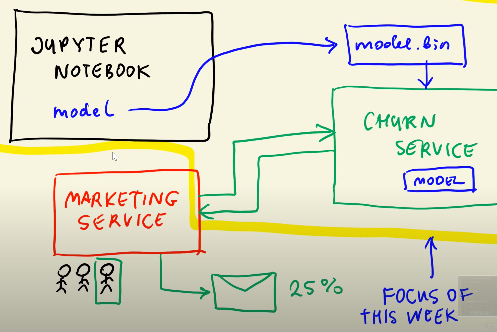

> Previous: [Evaluation metrics for Classification models](04_classification_eval_metrics.md)

> [Back to Index](README.md)
>> Extra: [Virtual environments on Intel Macs](05b_virtenvs.md)

> Next: [Decision Trees](06_trees.md)

# Deploying Machine Learning Models

## Overview

Jupyter Notebook is useful for prototyping and developing but it's not meant for production environments, because the notebook may contain things such as plots and prints that are useful for understanding our models but are unnecessary in production.

For production environments, we need to ***extract*** the model in a way that can be used by other components such as ***web services***.

Using the _Churn_ exercise from weeks 2 and 3, a production environment for our Churn model could be the following:

* `model.bin` file, containing the model extracted from the notebook.
* `Churn service` which exposes the model and allows other components to access it and make predictions.
* `Marketing service` is used by users who want to make predictions. The users input customer data into the service and the service communicates with Churn to request a prediction. Once the prediction is received, the service can execute whichever task is deemed appropiate, suchn as sending emails with offers to potentially churning customers.

## Extracting the model

1. Save whichever variables you may need (such as the model or the one-hot encoding vectorizer) as files with `pickle`. Include the ability to save to files and open files in your code.
1. Export the `.pynb` file as a `.py` file. Clean it up by moving the imports to the top and removing unnecessary steps such as plots and unnecessary prints.
1. Separate the _train_ and _predict_ methods by creating 2 different `.py` files, each containing each method, if needed.

## Enforce reproducibility with virtual environments

Tools like `pipenv` and `poetry` are useful to create virtual environments on which to develop and test the application. They also allow to specify which versions should be used for each library in order to reproduce the same results.

`conda` can also be used, although it's slightly more cumbersome.

Check the [Python virtual environment management gist](https://gist.github.com/ziritrion/8024025672ea92b8bdeb320d6015aa0d) for a pipenv cheatsheet.

## Expose the model with a function and a web framework

Frameworks like `flask` are useful to expose methods like `predict()` in the form of web services which can be accessed with programatic requests.

Check the [Python reference gist](https://gist.github.com/ziritrion/9b80e47956adc0f20ecce209d494cd0a) for a Flask cheatsheet.

## Deploy the model with containers

Using containers (a form of light virtualization) with tools such as `docker` allows for reproducible deployments. Python virtual environments are unnecessary in containers, but `pipenv` can easily install any dependencies on a system level in order to easily deploy from a test virtualenv to a container.

Check the [VM and containers gist](https://gist.github.com/ziritrion/1842c8a4c4851602a8733bba19ab6050) for a Docker cheatsheet.

## Push the container to the cloud

Tools such as Amazon Web Services Elastic Beanstalk offer easy ways to push a container and deploy it to a production environment.

> Previous: [Evaluation metrics for Classification models](04_classification_eval_metrics.md)

> [Back to Index](README.md)
>> Extra: [Virtual environments on Intel Macs](05b_virtenvs.md)

> Next: [Decision Trees](06_trees.md)