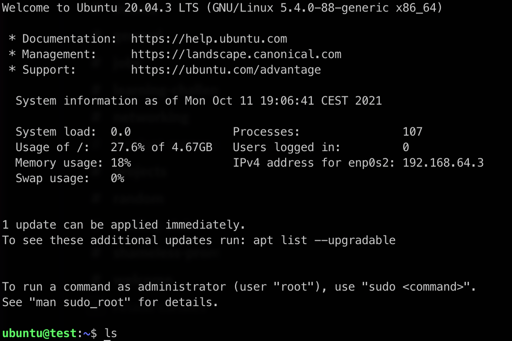
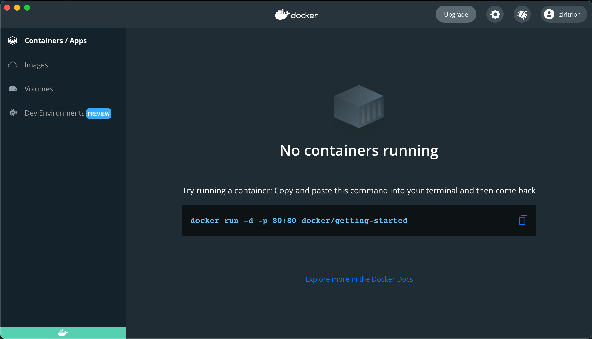
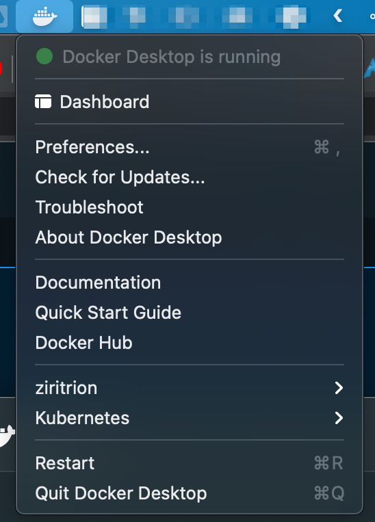

> Previous: [Evaluation metrics for Classification models](04_classification_eval_metrics.md)

> [Back to Index](README.md)
>> Return to: [Deployment](05a_deployment.md)

> Next: [Decision Trees](06_trees.md)

This is a quick & dirty guide to setting up the environment in an Intel Mac in order to complete the homework for Week 5.

# Basic concepts

The following are very basic definitions in order to understand what we're doing.

* ***Python virtual environment***: a _virtual environment_ provides a way to set specific Python and library versions in a lightweight manner. The idea is that you can replicate the environment on a different computer and get exactly the same results you got in the first machine.
* ***Virtual Machine***: a _VM_ kind of simulates a computer running as a program along your regular computer software. The VM software shares some of the _host_'s resources with the _guest_ VM; the guest thinks it's running in a fully fledged computer even though it's not. A VM runs its own operating system and any software you may need. VM's are very powerful but take a lot of computing power.
* ***Container***: containers are similar to VM's but instead of having their own operating system, each container makes use of the host's operating system. The result is that they're much more lightweight and take many less resources than VM's in the same computer.

# Before we begin

Make sure you [install Homebrew; click here to see how](https://brew.sh/). It will make your life much easier.

If you've never used a Terminal before, open Spotlight (press Command + Spacebar) and type `terminal` to find it, or search for it in Launchpad. Paste in the install instructions from Homebrew's website.

After you've installed Homebrew, you can ***optionally*** install a better Terminal program with Homebrew. Open the Terminal and type in `brew install iterm2`. Close the Terminal after it has finished installing. You may now open `iTerm` from Spotlight or Launchpad.

For the rest of this guide, when refering to _a terminal_, it refers to either `Terminal` or `iTerm` indistinctively.


# Python Virtual Environments

There are a few ways to set up virtual environments in Python:

* `venv`
* `conda`
* `poetry`
* `pipenv`
* Etc.

Question 4 of Week 5 required the use of `pipenv`. [You may follow the install instructions on pipenv's website](https://pipenv.pypa.io/en/latest/). However, I was unable to build the `Pipfile` and `Pipfile.lock` files successfully on a Mac (Intel based).

My workaround was to use an Ubuntu Virtual Machine.

# Creating and managing Ubuntu VM's

Ubuntu is a Linux distribution (or distro). It's widely used because it's relatively easy to install and use; there's also a huge community around it which makes it easier to solve problems by simply searching how the community fixed it.

Installing Ubuntu on a computer can be intimidating. Many people install 2 or even more operating systems on the same computer (this is called _dual booting_), but maintaining 2 separate operating systems can become annoying fast. Thus, virtualization becomes attractive if we only need to use the second operating system sporadically.

If you need a Graphical User Interface, then the quick and easy VM software to use is [VirtualBox](https://www.virtualbox.org/). However, it's fairly slow and bloated, therefore unnecessary for what we need in Week 5.

If we only need a Command Line Interface (CLI) for our VM, then the easiest way to create an Ubuntu VM is with [Multipass](https://multipass.run/).

## Multipass setup

(Cheatsheet available [in this gist](https://gist.github.com/ziritrion/1842c8a4c4851602a8733bba19ab6050))

Assuming you already installed Homebrew:

1. Open a terminal and type the following:
    * `brew install multipass`
    * You might need to type in your password in order to install it successfully.
1. Create a new VM with this command:
    * `multipass launch --name your_instance_name`
    * This will create and launch an ***instance*** with a name of your choosing.
    * By default, the latest Long Term Support Ubuntu release will be used as a base. As of October 2021, the latest LTS release is 20.04.
    * If this is your first time creating a VM after installing Multipass, it will take a while to download all of the necessary components.
1. Check that your new instance is running:
    * `multipass list`
    * The state should be "running".
1. Enter your instance's terminal with this command:
    * `multipass shell test`
    * You should see something like this.

1. Exit the Ubuntu VM's terminal with this command:
    * `exit`
    * This will log you out of the Ubuntu terminal.
1. Your Ubuntu VM is still running even after you log out (you can check this by typing `multipass list` again). A running VM takes resources away from your computer, so you should always turn any VM off that you're not using. To turn it off, type this command:
    * `multipass stop your_instance_name`
1. To run the instance again without creating a new one, run this command:
    * `multipass start your_instance_name`
1. You may need to copy files from your local computer to the VM and viceversa. You can set up a shared folder that both the VM and your computer share: any changes in the folder can be seen on both sides. To do so, type the following command:
    * `multipass mount path/to/your/local/folder your_instance_name:path/to/instance/folder`
    * In MacOS, let's asume you created a folder called `mlzoomcamp` in your personal folder and you also want to access it in the personal folder in your VM. The command to mount the folder would then be `multipass mount ~/mlzoomcamp your_instance_name:~/mlzoomcamp`.
1. Check the info of a specific instance, such as mounted folders and the resources it's using with this command:
    * `multipass info your_instance_name`

You can create as many VM's as you want, but keep in mind that any VM takes storage space on your computer. Avoid running multiple VM's at the same time unless you know what you're doing.

Check the [cheatsheet](https://gist.github.com/ziritrion/1842c8a4c4851602a8733bba19ab6050) or the [Multipass docs](https://multipass.run/docs/working-with-instances) for more info.

## Basic Linux/Ubuntu/Bash commands

Here are some basic commands to make yourself at home inside your VM instance (many of these are common to MacOS as well).

Feel free to skip this section if you're already familiar with bash.

* `ls` : same as `dir` in Windows. It shows the contents of your current folder/directory.
* `cd folder` : short for "change directory". Same behavior as in Windows. Changes your current directory to the directory you state after `cd`.
    * `cd ..` : move to the parent folder of your current folder. Note the space between the `d` and the first period.
    * `cd ~` : move to your personal folder (AKA home directory). `~` is shorthand for `/home/username/`.
    * `cd /` : move to the root folder. In Linux (and MacOS), the base folder from which all other folders hang from is called the root folder, and it's represented with `/`. You shouldn't need to access the root directory during this course.
* `rm file` : remove file. It won't work on folders.
    * `rm -r folder` : remove folder.
* `sudo` : short for "superuser do". Sometimes you may need to run special commands which need administration privileges because they could potentially harm your computer, like installing new software. In those cases, you will have to type `sudo` before typing your command. The terminal may then ask for your password in order to authorize the command.
* `apt` : APT is Ubuntu's package manager. You install, update and uninstall most software using this command.
    * `sudo apt update` : this will update all of `apt`'s sources in order to know which packages need upgrading.
    * `sudo apt upgrade` : this will upgrade all of the packages that have newer versions available.
    * `sudo apt update && sudo apt upgrade` : combine the 2 previous commands into one.
    * `apt search package_name` : search for a specific package.
    * `sudo apt install package_name` : install a package.
    * `sudo apt remove package_name` : uninstall a package.
    * Note that different Linux distros may use different package managers other than `apt`. In a previous section we installed `homebrew` on Mac, which is a package manager for MacOS. Debian and Debian-based distros (such as Ubuntu) use `apt`; other distros may use `YUM`, `pacman`, etc.

## Install pipenv on Ubuntu VM

On a brand new Ubuntu VM, Python is preinstalled but the command `python` won't work. You can use the command `python3` instead, but it get annoying fast, so let's fix this. Run the following command:

```sh
sudo apt install python-is-python3
```

You can now use `python` normally.

We still can't install pipenv because Ubuntu does not have pip installed. We can install it with `apt`:

```sh
sudo apt install python3-pip
```

We can now install pipenv:

```sh
pip install pipenv
```

You should now be able to finish questions 1, 2, 3 and 4 of the Week 5 homework.

I strongly suggest to mount a shared folder to easily share files between your computer and your VM. It will make your life easier for questions 5 and 6.

[Click here for a pipenv (and conda) cheatsheet](https://gist.github.com/ziritrion/8024025672ea92b8bdeb320d6015aa0d).

# Docker

For questions 5 and 6 of Week 5, you will need to install Docker. Docker is available for Intel Macs. I believe there is now some sort of support for Apple Silicon Macs but I have not tested this and I do not have a way to do so.

If you do not know what CPU you've got, click on the Apple icon on the top left corner on the screen and click on "About this Mac". Check the "Processor" listing.

This guide assumes you have an Intel Mac. If you've got an Apple Silicon Mac, feel free to follow these steps but I cannot say whether they will work or not. You can check Docker's official website to understand the differences in usage [here](https://docs.docker.com/desktop/mac/apple-silicon/).

## About Docker

Docker is a container technology. As previously mentioned, containers are a form of virtualization that take less resources than VM's because they rely on the host OS instead of virtualizing the OS itself. However, Docker is a Linux container technology; Docker on MacOS or Windows will actually use a VM to virtualize Linux in order to run the containers on top.

Luckily, the `docker` commmands and Docker Desktop will take care of the VM for you; using Docker should be a similar experience on any of these operating systems. But the containers will probably be slower and take more resources than they would do if you were using native Linux.

I recommend shutting down any running VM's you're not actively using before using Docker.

## Docker Setup

Install Docker with Homebrew:

```sh
brew install --cask docker
```

This will install Docker Desktop, which is a convenient way to handle Docker images and containers, and it also includes command line commands.

Open Docker by searching por it on Spotlight or Launchpad. The Docker main window should appear, like this:



You can now close this windows with the red button on the top left. Docker will still run in the background; you should see the Docker icon on the top bar.



As long as the drop down menu says that Docker Desktop is running, we should be good to go.

You can now go to the terminal and use `docker build` and `docker run` commands normally. You should now be able to finish exercises 5 and 6 of Week 5.

[The previously linked cheatsheet for Multipass also has a cheathseet for Docker](https://gist.github.com/ziritrion/1842c8a4c4851602a8733bba19ab6050), with example `Dockerfile` instructions.

## Final notes on Docker

Docker containers are _stateless_. This means that any changes that happen inside a container will be lost when the container stops running. You're not supposed to do things like updating packages inside a container; instead, you create a new image with updated software and spawn new containers from it.

There are ways to store data generated by containers: you can create _volumes_ and assign them to containers; volumes are like special shared folders that containers can use to read an write data. This is useful if you need persistent data (e.g. databases, datasets, etc) and you need to turn off the container or change from one container to another. However, explaining how to use volumes falls outside the scope of this guide. You can check out [Docker's official documentation](https://docs.docker.com/) if you want to learn more about Volumes and Docker in general.

> Previous: [Evaluation metrics for Classification models](04_classification_eval_metrics.md)

> [Back to Index](README.md)
>> Return to: [Deployment](05a_deployment.md.md)

> Next: [Decision Trees](06_trees.md)