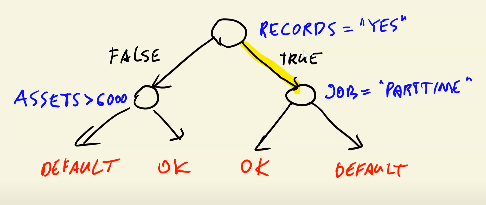
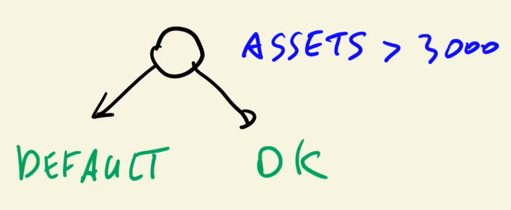

> Previous: [Deployment](05a_deployment.md)
>> Extra: [Virtual environments on Intel Macs](05b_virtenvs.md)

> [Back to Index](README.md)

> Next: [Midterm Project](../07_midterm_project/README.md)
>> Extra: [Midterm Project Tips & Tricks](07_misc.md)

# Decision Trees

A ***decision tree*** is a flowchart-like structure in which each internal node is a test on an attribute (such as flipping a coin and getting heads or tails), each branch is the outcomes of such test and each leaf/final node represents a class label (a _decision_ after computing all attributes).

A tree with just one level is called a _stump_.

Deep decision trees are prone to ***overfitting***: they memorize their training dataset and cannot generalize well to new data. Thus, measures have to be kept in place, such as limiting the depth of the tree.

# Decision Tree Algorithm

Using a simple stump as an example we can see how a decision tree is created.

Starting with a simple dataset:

| index | assets | status |
| --- | --- | --- |
| 0 | 0 | default |
| 1 | 2000 | default |
| 2 | 3000 | default |
| 3 | 4000 | ok |
| 4 | 5000 | ok |
| 5 | 5000 | ok |
| 6 | 8000 | default |
| 7 | 9000 | ok |

(The dataset has been ordered by _assets_; it would normally be randomized).

We shall now create tree with a single layer (a stump) trained on assets to predict the status of a client.

If we count every single unique value, we can define decision thresholds based on those values: `[0, 2000, 3000, 4000, 5000, 8000]`, with `assets > threshold` as our _condition_ (we're not including `9000` because all values would belong to the negative class).

If we set our threshold at `T=4000` our split would be that values [0,3] would be predicted as _negative_ (or in this case, _default_) and values [4,7] would be predicted as _positive_ (_ok_).

* assets > 4000 = ok

| index | assets | status | prediction |
| --- | --- | --- | --- |
| 0 | 0 | default | default |
| 1 | 2000 | default | default |
| 2 | 3000 | default | default |
| 3 | 4000 | ok | default |

* 3 correct prediction for negative class, 1 wrong.

| index | assets | status | prediction |
| --- | --- | --- | --- |
| 4 | 5000 | ok | ok |
| 5 | 5000 | ok | ok |
| 6 | 8000 | default | ok |
| 7 | 9000 | ok | ok |

* 3 correct prediction for negative class, 1 wrong.

We can now calculate the ***impurity*** for each threshold. We will use the ***misclassification rate*** for calculating the impurity (total amount of errors divided by the total population).

* Impurity for negative: `1 error / 4 total results = 1/4 = 0.25`
* Impurity for positive: `1 error / 4 total results = 1/4 = 0.25`
* Average impurity: `0.25`

We can now calculate the impurity for all thresholds:

| Threshold | Decision left | Impurity left | Decision right | Impurity right | Average |
| --- | --- | --- | --- | --- | --- |
| 0 | default | 0% | ok | 43% | 21% |
| 2000 | default | 0% | ok | 33% | 16% |
| 3000 | default | 0% | ok | 20% | 10% |
| 4000 | default | 25% | ok | 25% | 25% |
| 5000 | default | 50% | ok | 50% | 50% |
| 8000 | default | 43% | ok | 0% | 21% |

Thus, the best threshold for this example would be `3000`, with an impurity of 10%. Our decision tree will then look like this:

If we had additional features, we could also create a decision table for that feature with all the thresholds and impurities. The lower the impurity, the more useful that feature with that particular threshold is.

In short:

    for f in features:
        find all thresholds for f
        for t in thresholds:
            split dataset using "f > t" condition
            compute impurity of this split
    select condition with lowest impurity

After choosing the best condition, we can choose the following best and split our resulting nodes, and so on reursively. However, we need a stopping criteria, because the tree could easily overfit.

The ***stopping criteria*** defines when we should keep going and creating new splits or stop. the criteria are:
* The leaf is already pure -> any splits we create from it will predict exatly the same.
* The tree reached the depth limit -> we set a depth limit beforehand and we've already reached it.
* The leaf is too small to split.

Here's the resulting final algorithm:

    find the best split
    stop if the max depth has been reached
    if left leaf is large enough and not pure:
        repeat for left
    if right lead is large enough and not pure:
        repeat for right
            
## _Reality check_

In practice, misclasification rate isn't used for impurity. ***Gini impurity*** and ***Entropy (information gain)*** are much more common.

Decision trees can also be used to solve regression problems, using different criteria such as Mean Squared Error and Half Poisson Deviance.

More detailed info is available at [Scikit-learn's Decision Trees documentation page](https://scikit-learn.org/stable/modules/tree.html).

# Hyperparameter tuning

There are 2 ***hyperparameters*** (parameters chosen outside the algorithm) worth considering for decision trees: ***maximum tree depth*** and ***minimum samples per leaf*** (minimum amount of samples a leaf must have in order to consider the split as valid/worth considering).

In `scikit-learn`, these hyperparams are:

* `max_depth` (default: `None`).
* `min_samples_leaf` (default: `1`).

There are actually many more hyperparameters, but these 2 would be the most important to consider in order of importance. It's recommended to iterate on these hyperparameters in this particular order.

# Random Forests

This is the overall workflow of a decision tree model:

The model is a single decision tree. We trust that it has been trained with the correct features and thresholds in order to calculate the correct probability.

In contrast, a ***random forest model*** consists of a collection of different trees which have been trained on different feature subsets. Each tree outputs a prediction and the final prediction is the average of all of them.

The feature subsets are chosen at random for each tree. On average, Random Forests show better accuracy than single decision trees.

Besides `max_depth` and `min_samples_leaf`, Random forests have one hyperparameter of interest:

* `n_estimators` (default: `100`). Number of trees in the forest.

Some secondary hyperparameters of interest:

* `max_features` (default: `auto`). Number of features to consider for each split.
* `bootstrap` (default: `True`). If `False`, the whole dataset is used to build each tree. If `True`, each tree is build with random subsamples _with replacement_ (datapoints can be repeated), AKA ***bootstrapping***.

# Gradient Boosting

A Random Forest contains multiple trees, but each tree has been randomly generated.

***Gradient Boosting*** is the technique by which a single model is improved upon by measuring its ***error*** and modifying the model in order to reduce the error.

If our model consists of a single tree, then we get ***Gradient Boosted Trees***.

Random Forest is a ***parallel*** technique, but gradient boosting is ***sequential***. In order to train each model, the previously trained model is necessary.

The most popular implementation of Gradient Boosted Trees is ***XGBoost***. XGBoost works with optimized datatypes called ***DMatrices***.

XGBoost is very popular due to its very accuracy but it's also prone to overfitting. In order to monitor the performance on each iteration, we can create _watchlists_ with train and evaluation data, and XGBoost will use it to evaluate the model after each iteration.

In XGBoost there are 3 hyperparameters of importance:

* `eta` ( 𝜂 , default: `0.3`), AKA ***learning rate***. Defines the weight applied to the new predictions in order to correct the previous predictions (in other words, the step size of each optimization). Bigger learning rate leads to faster training but worse accuracy because it cannot finetune the results; smaller learning rate results in more accurate results but takes longer to train.
* `max_depth` (default: `6`); virtually the same as in scikit-learn.
* `min_child_weight` (default: `1`); virtually the same as `min_samples_leaf` in scikit-learn.

Other hyperparameters of interest:

* `colsample_bytree` (default: `1`) is the subsample ratio of features/columns when constructing each tree.
* `subsample` (default: `1`) is the subsample ratio of the training instances/rows.
* `lambda` (default: `1`) AKA L2 regularization.
* `alpha` (default: `0`) AKA L1 regularization.

Out of all the methods we've seen, Gradient Boosting Trees are often the model with the better performance, but they're harder to train and finetune than decision trees or random forests.

> Previous: [Deployment](05a_deployment.md)
>> Extra: [Virtual environments on Intel Macs](05b_virtenvs.md)

> [Back to Index](README.md)

> Next: [Midterm Project](../07_midterm_project/README.md)
>> Extra: [Midterm Project Tips & Tricks](07_misc.md)