> Previous: [Midterm Project](../07_midterm_project/README.md)
>> Extra: [Midterm Project Tips & Tricks](07_misc.md)

> [Back to Index](README.md)

> Next: [Serverless Deep Learning](09_serverless.md)

# Introduction to Deep Learning

**Deep Learning** (DL) is a ML technique that uses ***deep neural networks*** (DNN's) as models.

A deep neural network is a model inspired by animal brains. It's composed of interconnected _nodes_ (or _neurons_) arranged in _layers_ which process a _signal_ (a real number) and send it to other node layers, until the signal reaches an _output layer_ and the final result can be obtained.

Depending on the structure of the connections and the nature of the operations, DNN's can be classified into many subtypes (_multilayer perceptrons_, _convolutional neural networks_, _recursive neural networks_, etc).

So far, we've only seen techniques that deal with _tabular data_; data which fits neatly into tables. But not all data can fit into tables, and not all techniques with good results for tabular data can be used on non-tabular data. This is where DL comes in.

DL can be used for both regression and classification problems that deal with non-tabular data such as images, video, audio,etc. DNN's have been proven to be very reliable models that have pushed the ML field forward, but they're very complex and hard to train.

# TensorFlow and Keras

## Intro

**TensorFlow** is a library for ML and AI. **Keras** is a library that provides a Python interface for TensorFlow, making it simpler to use. Keras used to be an independent library but has been absorved into TensorFlow.

```python
import tensorflow as tf
from tensorflow import keras
```

## Working with images

```python
from tensorflow.keras.preprocessing.image import load_img

# filepath is the path to the file containing an image
img = load_img(filepath, target_size=(299, 299))
```

When loading an image with `load_img()`, the resulting object is a **PIL image**. **PIL** stands for _Python Image Library_; PIL used to be a library but it was abandoned and nowadays the **Pillow** library is used instead, but the image format is the same.

A PIL image object is essentially an array. In the case of color images, a PIL image will have 3 **channels**, one for each RGB color. A _channel_ is a matrix where each component represents a pixel, and its value ranges from 0 to 255 (1 byte). Thus, a pixel is composed of 3 different values, one for each elemental color, and these values are found in the same position in the 3 matrices.

Neural networks that deal with images expect the images to all have the same size. `target_size` inside `load_img()` allows us to define a final size in pixels for the converted image, as in `load_img(target_size=(299, 299))`.

The final size of the PIL image can be calculated as `(h, w, c)`, where `h` is the height of the image, `w` is the width and `c` is the number of channels in the image.

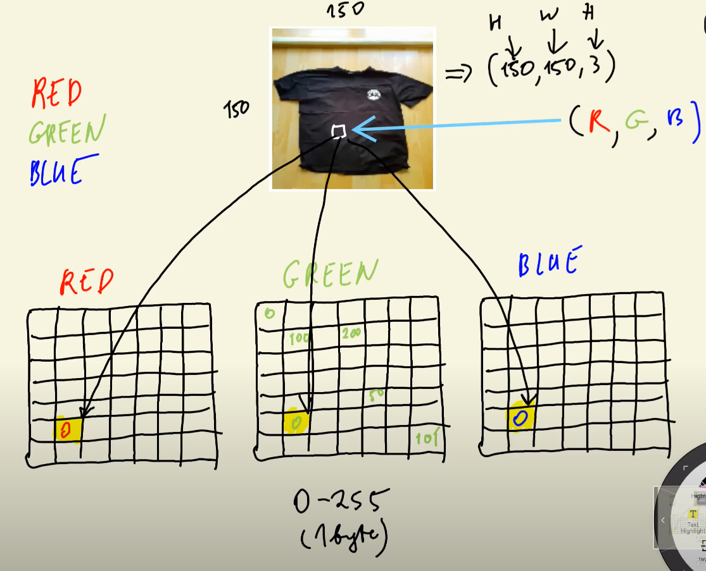

PIL images can easily be converted to NumPy arrays of `dtype=uint8` (unsigned integers of size 8 bits):
* `x = np.array(img)`

# Pre-trained convolutional neural networks

Instead of training a DNN from scratch, we can use a pre-trained network in order to speed up work. There are many pre-trained networks available online.

The standard training dataset for general image classification is **ImageNet**, a dataset with over a million images in 1000 different categories.

For this example we will use a Xception network pre-trained on ImageNet.

```python
from tensorflow.keras.applications.xception import Xception
from tensorflow.keras.applications.xception import preprocess_input
from tensorflow.keras.applications.xception import decode_predictions

model = Xception(weights='imagenet', input_shape(299, 299, 3))

# Batch, check notes below
X = np.array([x])

X = preprocess_input(X)

pred = model.predict(X)
decore_predictions(pred)
```

* We instantiate a Xception network with pre-trained weights on the ImageNet dataset. We also specify a specific input shape that all input images must have; in this example, images will be of size 299x299 pixels with 3 channels (RGB color).
* Xception takes a ***batch*** of images as input. A _batch_ is an array that contains images. The first dimension of this array contains the number of images, so if we were to input 5 images, we'd need an array of size `(5, 299, 299, 3)`.
    * Since we only have a single image to use as input, we need to wrap it inside a batch. `np.array([x])` takes `x` of size `(299, 299, 3)`, puts it inside a list with it as its single element and is then converted to a NumPy array, which results in an array of size `(1, 299, 299, 3)`.
* Xception also expects all images to have been preprocessed in a specific way. The Xception implementation in Keras provides a `preprocess_input()` function that takes a batch of images and preprocesses them in the format that Xception expects.
    * Essentially, it converts the original integer values in the `[0,255]` range to real values in the `[-1, 1]` range.
* `model.predict()` returns an array with 1000 values for each input image. Each value is the probability that the input image belongs to one of the 1000 categories in ImageNet.
* `decode_predictions()` is a convenient translation function that converts the prediction probabilities to human-readable output, in order to understand the categories.

Pre-trained DNN's are useful for speeding up work, but they may have been pretrained for tasks that do not match our needs. For example, if we want to work with ***Fashion-MNIST***, a dataset that contains images of clothing, and we want to correctly classify images of T-shirts, we cannot use the code above because ImageNet does not have a T-shirt category, and we end up classifying a T-shirt picture as a jersey, a sweatshirt or even a bulletproof vest.

# Convolutional Neural Networks

A **Convolutional Neural Network** (CNN) is a type of DNN that is well suited for dealing with images. The Xception network used in the previous section is an example of CNN.

CNN's have 2 type of layers: ***convolutional*** and ***dense***, as well as a special type called ***pooling***:

* A **convolutional layer** (CL) is made of "filters": matrices that recognize specific patterns. The filters move accross the image and create an output consisting of a "similarity array", or a filtered image where every "region" has a higher value the more similar it is to the filter. These outputs are called **feature maps**.
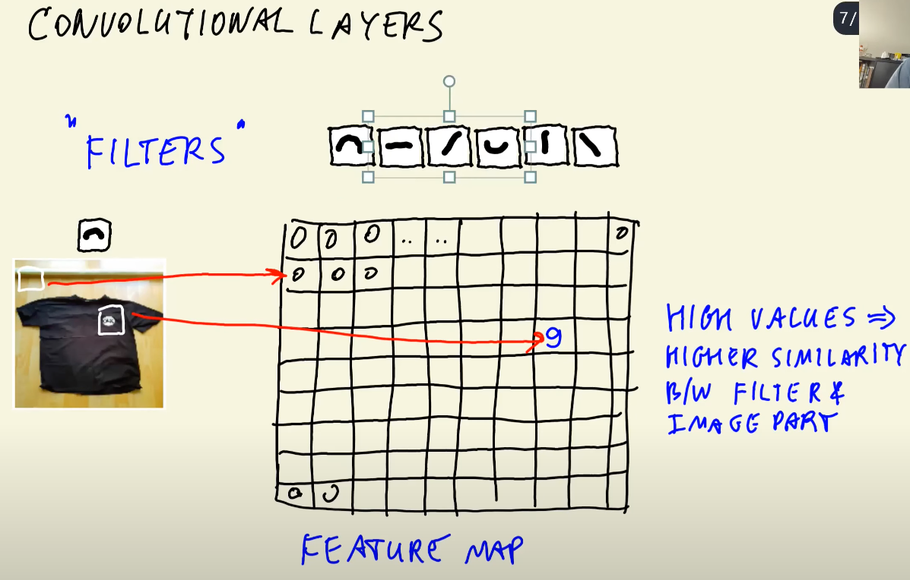
    * Each filter will output a feature map, so the output of the convolutional layer will have as many feature maps as filters.
    * These feature maps are then passed to another convolutional layer with its own set of filters, which will output another set of feature maps, which can then be sent to another CL, and so on. For example, a CL with 6 filters will output 6 feature maps, which will then be fed to another CL with 12 filters, thus outputting 12 feature maps.
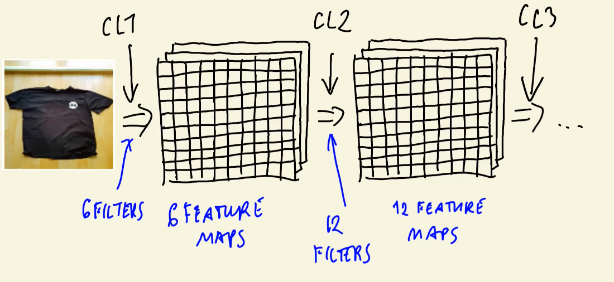
    * The filters on each CL are increasingly complex, thus allowing us to recognize complex patterns. An early CL might recognize simple shapes such as lines, but a later CL might recognize more complicated shapes such as squares or circles, and so on.
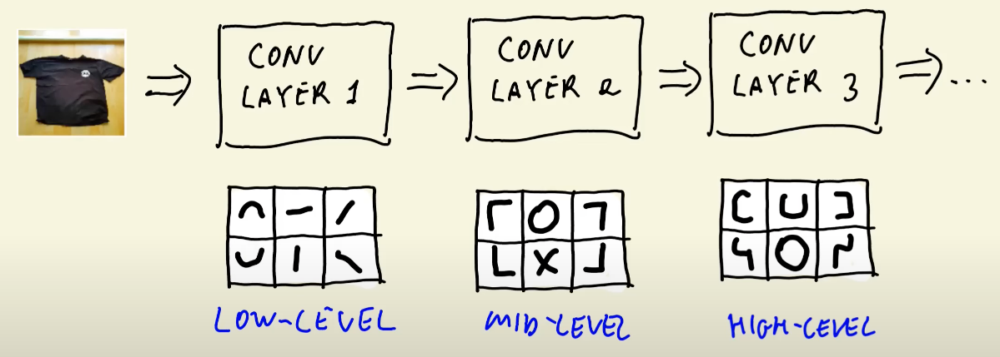
    * Filters act on all feature maps at the same time. If the input is 6 feature maps and there is only one filter, the output will be a single feature map because the filter looked at the same region in all of the input feature maps and compute the similarity value based on all of them.
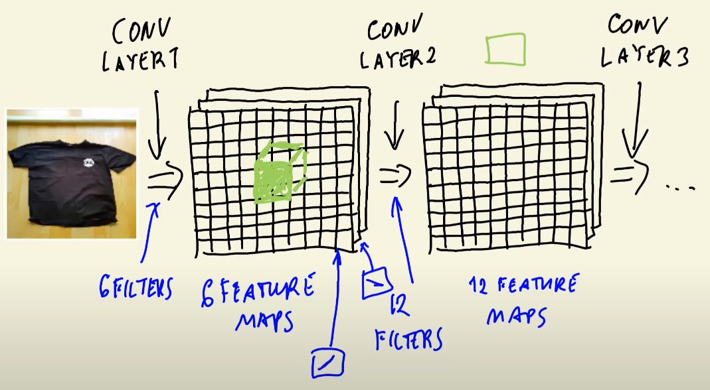
    * Filters are _learned_; they are not predefined. Training a CNN means training the filters.
    * A final CL will usually output a flat 1-D vector. For example, our `(299, 299, 3)` image could be converted to a `(2048)` vector. This vector is called a **vector representation** of the original image.
* A **pooling layer** is a special type of layer that is used along with convolutional layers. It essentially reduces the size of the feature maps, thus reducing the amount of parameters we need to deal with.
    * Pooling layers don't hawe weights that need to be trained. They just apply a simple operation on the feature maps, usually average or max values.
    * The main hyperparameter in pooling layers is the _pooling window size_, which specifies the area of the image in which the pooling operation will take place.
        * For example, a _max pooling layer_ with a pooling window of size `(2,2)` will take a 2x2 section of the image, keep the max value and discard the rest. This layer will eventually output a feature map whose sides have been halved in size.
* A **dense layer** is made of _nodes_ (or _neurons_) that apply linear and non-linear transformations to the input.
    * Each node takes each component of the input and applies a linear transformation to them (multiplies each value with a _weight_, then adds all the elements together along with an optional _bias_, the node's own weight), which results in an output in the form of a single scalar. The output then goes through an **activation function** (a non-linear transformation).
        * The outputs of a dense layer before going into its activation function are called _logits_.
    * Multiple nodes generate multiple outputs. Thus, the output of a dense layer is a vector.
    * For binary classification, we could create a single deep layer with a single neuron that takes the vector representation of an image as input and outputs a single value. This value could then go through a **sigmoid activation function**, which transforms the output to a value in the range `[0,1]`. Thus, we get the probabilty that the image belongs to the category we want.
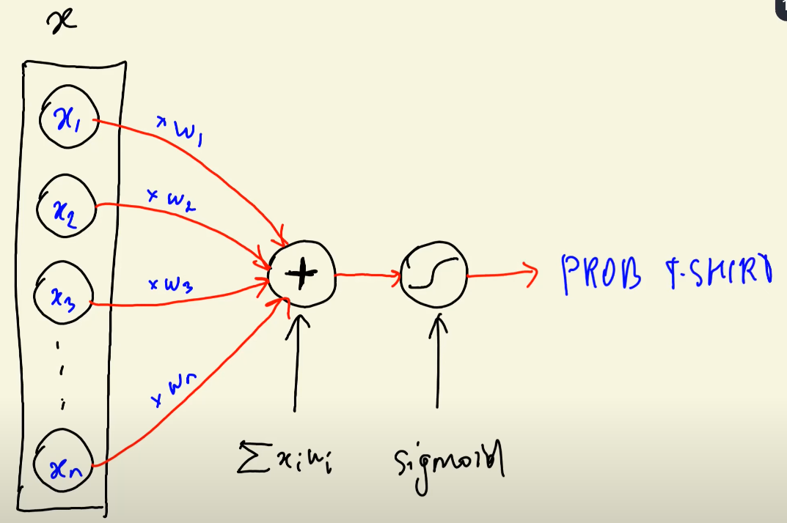
    * For multiclass classification, instead of having a single neuron in our dense layer, we could have as many neurons as categories, and then apply a **softmax activation function** to the output vector, which is an extension of the sigmoid function for multiple values, thus obtaining the probability for each category.
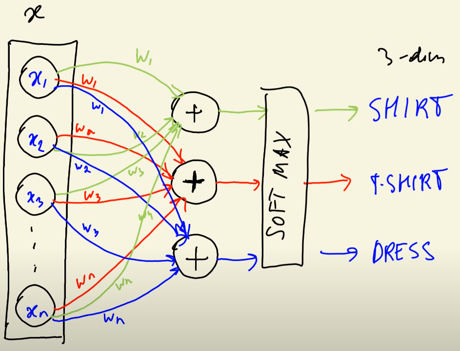
        * In other words, this dense layers is a collection of _multiple logistic regressions_.
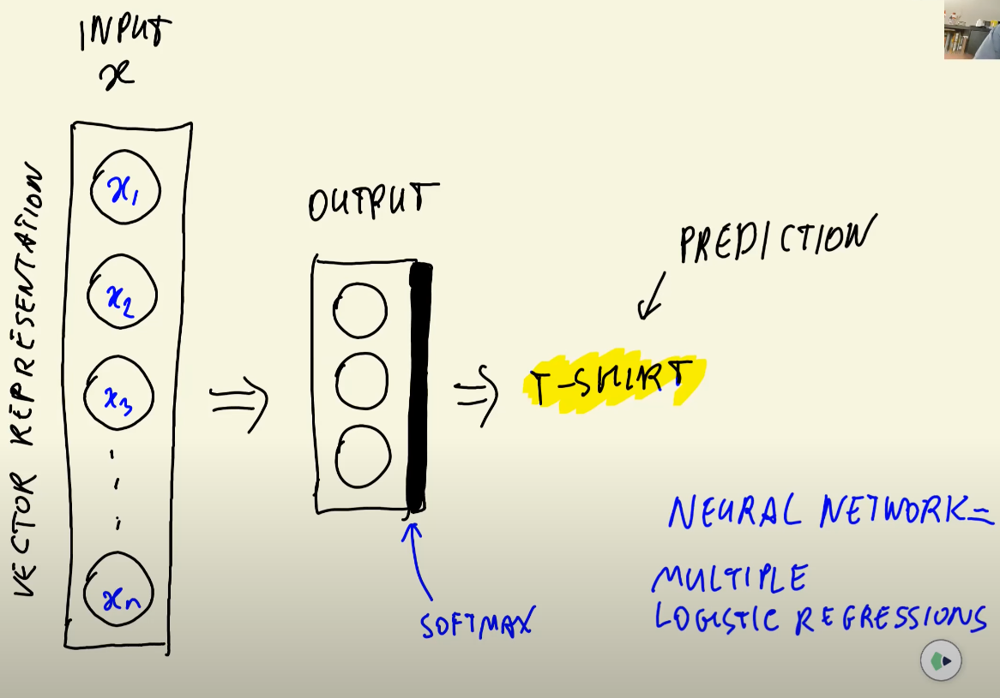
    * A dense layer can connect to another dense layer. The output of the first layer will be an _internal vector representation_ that will be fed to the next dense layer. We can connect as many dense layers as we want. These layers in between are called **hidden layers**.
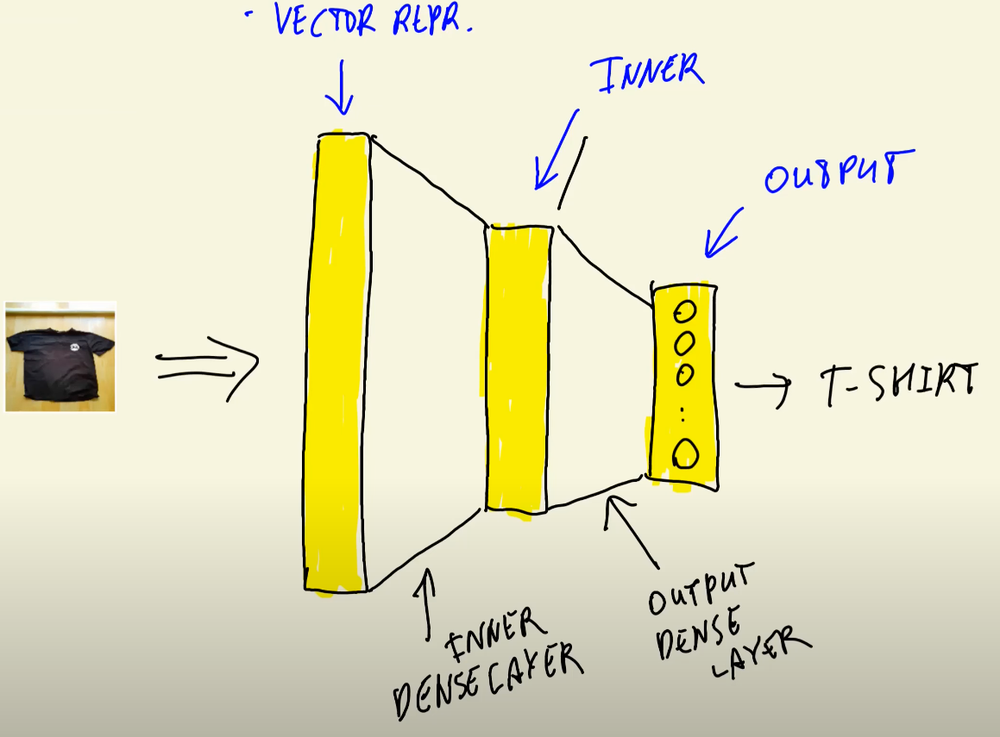
    * In practice, dense layers are systems of equations that can be interpreted as matrix operations. Check the [notes for Session 1](01_intro.md#linear-algebra) for a refresher.
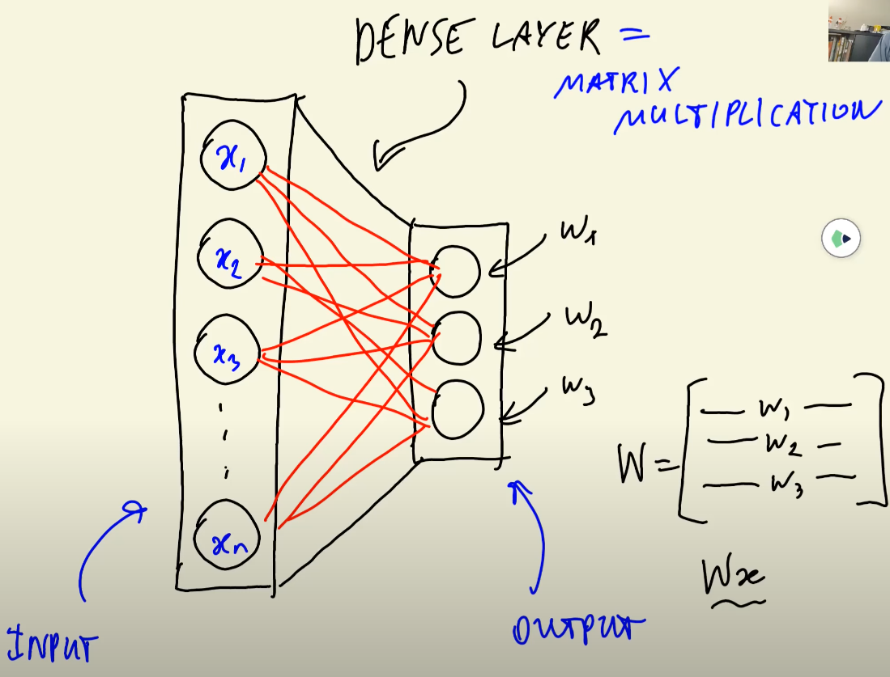

A CNN uses both convolutional and dense layers in order to process images and make predictions. Here's a main overview of a CNN.

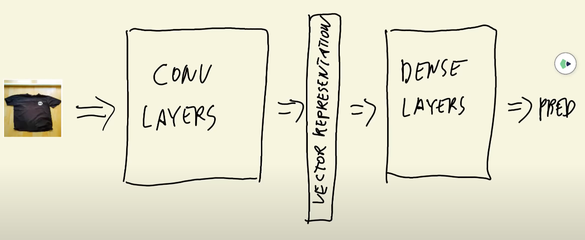

# Transfer Learning

We already saw that we cannot use a pre-trained network as it is for any task because the network was trained for a specific task. However, it's possible to reuse parts of the network. This is called **Transfer Learning**.

The idea is to reuse the vector representation that the convolutional layers of the CNN create, but we discard the dense layers and make our own for our specific task.

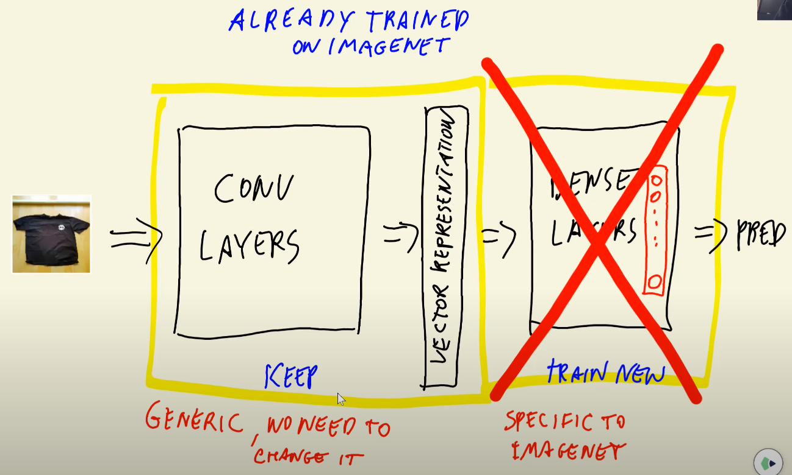

Following the Keras/Xception example from before, this is how we could do it.

## Datasets

```python
from tensorflow.keras.preprocessing.image import ImageDataGenerator

train_gen = ImageDataGenerator(preprocessing_function=preprocess_input)
train_ds = train_gen.flow_from_directory('./clothing-dataset-small/train', target_size=(150, 150), batch_size=32, class_mode='categorical')

val_gen = ImageDataGenerator(preprocessing_function=preprocess_input)
val_ds = val_gen.flow_from_directory('./clothing-dataset-small/validation', target_size=(150, 150), batch_size=32, shuffle=False)
```

* `ImageDataGenerator()` is a special class that allows us to create image datasets. We instantiate it in order to access its properties and functions.
    * `preprocess_input` is the image preprocessing function imported in the previous example.
* `flow_from_diractory()` takes images from a directory and creates a dataset.
    * We set `target_size=(150,150)` because a 150x150 image is 1/4 the size of the original 299x299 images, so the training will be 4 times faster.
    * `batch_size` specifies the amount of images that the network will take every time.
        * Knowing the image and batch size, we can calculate that the input will be of size `(32, 150, 150, 3)`, there will be `32` vector representations and `32` predictions as output.
    * `class_mode` specifies the kind of label arrays that are returned:
        * `categorical` is the default mode, for multicategory classification problems. Labels will be 2D one-hot encoded labels.
        * `binary` is for binary classification models. Labels will be 1D binary models.
        * There are more modes for other specific kind of problems (`sparse`, `input`) but they won't be covered here.
    * For the validation dataset we disable shuffling, since it isn't really necessary.
    * After creating the datasets, if we run `train_ds.class_indices`, we would get the categories that the dataset contains. These categories match the name and amount of folders inside the specified directory, so if our directory has the folders `cats` and `dogs`, our dataset will contain those 2 categories.

## Base model

We begin creating our model by creating a Xception network and removing the dense layers.

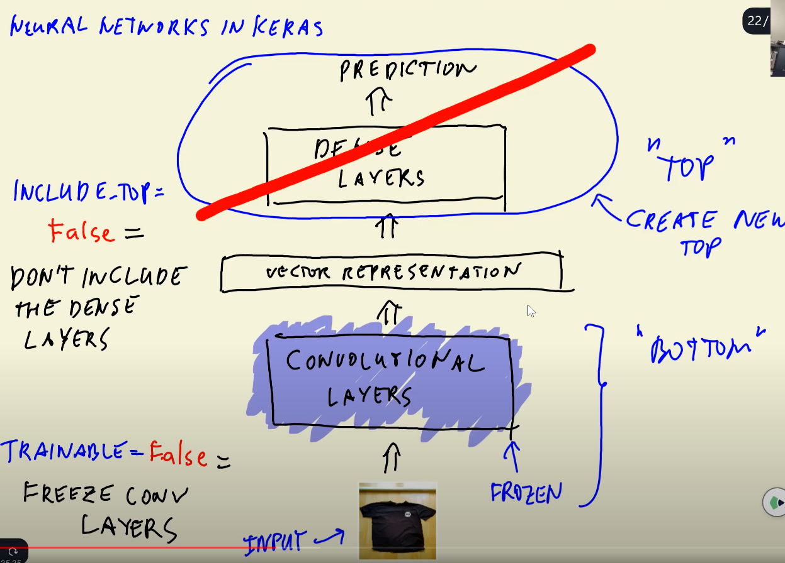

```python
base_model = Xception(weights='imagenet', include_top=False, input_shape=(150, 150, 3))

base_model.trainable = False
```

* In Keras terminology, the _top_ of a CNN is the dense layers, and the _bottom_ is the convolutional part. We want to replace the Xception top with our own, so we set `include_top` to `False`.
* We don't want to retrain the convolutional part of the network, so we _freeze_ the convolutional layers by setting our top-less model to `trainable = False`.

## Final model

With out top-less Xception model in place, we can define the rest of the model.

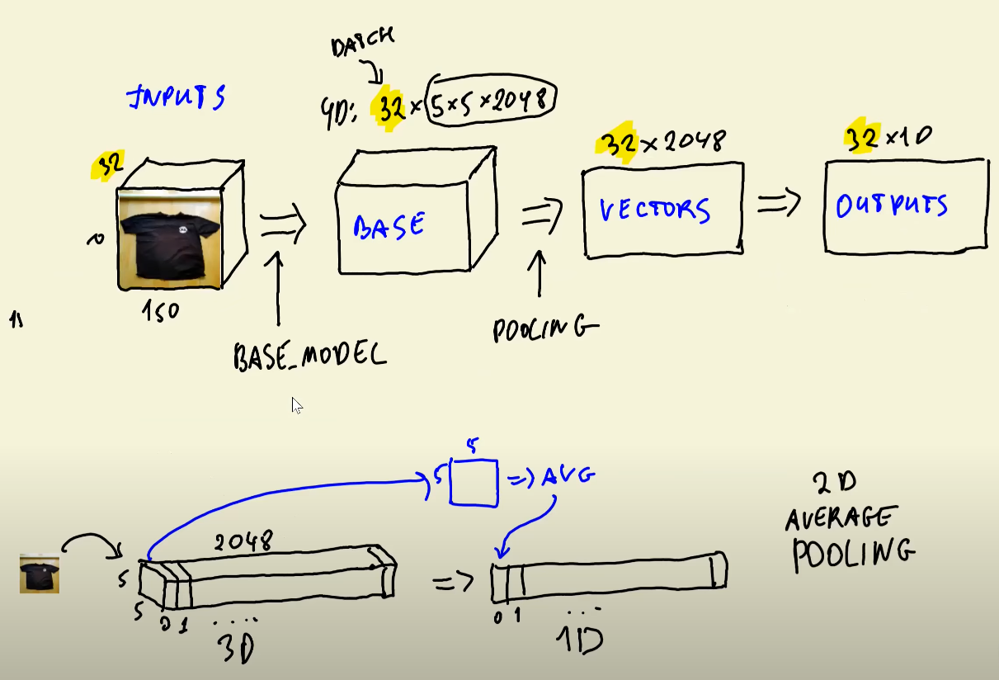

```python
inputs = keras.Input(shape=(150, 150, 3))

base = base_model(inputs, training=False)

vectors = keras.layers.GlobalAveragePooling2D()(base)

outputs = keras.layers.Dense(10)(vectors)

model = keras.Model(inputs, outputs)
```

* This code is written in ***functional style***: we use building blocks as _functions_ that are passed to each other in a row.
* `keras.Input()` is an object that defines the shape of the input of our final model. This seems redundant but it's what Keras asks for.
* `base` is the output of our base model, which takes `inputs` as input.
    * `training` needs to be set to `False` if we don't want to train it.
* We define our model by calling `keras.Model()` and defining the input and output of the network.
    * The output shape of `base` is `(32, 5, 5, 2048)`, which is the actual input of the top-less Xception. We actually need flat vectors for our vector representations, but these are not it!
* In order to get proper vector representations, we create a pooling layer. `keras.layers.GLobalAveragePooling2D()` creates an average pooling layer: it calculates the averages of the values in each 5x5 grid and uses it to flatten the vector, thus changing the shape from the original `(32, 5, 5, 2048)` to `(32, 2048)`.
    * Notice the `(base)` at the end. This is syntactic sugar for the following 2 lines:
        * `my_function = keras.layers.GlobalAveragePooling2D()`
        * `vectors = my_function(base)`
    * Remember we're coding in functional style! We first define a function, and then we call that function with a specific input. Our input in this case is `base`, which is the output we've got so far, so instead of using 2 lines, we can simply define the function and pass the input in a single line.
* We now create our dense layer with `keras.layers.Dense()`. We define the output to be of size `10` for this example, so we will be able to predict 10 different categories.
    * Like in the previous line, we define the function and pass its input in a single line; `vectors` in this case .
* Finally, we wrap everything with `keras.Model(inputs, outputs)`.
* If we now call `preds = model.predict(X)`, `X` must have the shape defined by `inputs` in order to work, and `preds` will have undergone all the processing that `outputs` has gone through. With this code, the output will be of size `(32, 10)`.

## Training the model

Our dense layer is not trained. When initialized, its weights are set to random values.

The **optimizer** is the element which "trains" the values of the weights by changing them on each training iteration in a way to make the output of the network make sense.

There are many optimizer algorithms. For our example we will use `Adam`.

The optimizer also needs to know how to change the weights and check how good the changes are. This is done with a **loss function**, which is a metric that calculates the difference (_loss_) of the network's output with the target.

There are also many loss functions. We will use `CategoricalCrossentropy` because we're dealing with a multiclass classification problem (if we were dealing with a regression problem, we could use `MeanSquaredError`)

```python
learning_rate = 0.01
optimizer = keras.optimizers.Adam(learning_rate=learning_rate)

loss = keras.losses.CategoricalCrossentropy(from_logits=True)

model.compile(optimizer=optimizer, loss=loss, metrics=['accuracy'])

model.fit(train_ds, epochs=10, validation_data=val_ds)
```

* `learning_rate` defines the "step size" when changing the values. Higher values train faster but might not be precise enough to find ideal values; lower values are more precise but are much slower to train.
* `keras.losses.CategoricalCrossentropy()` is our loss function.
    * When `from_logits` is set to `True`, the loss function will take the _logits_ (layer values before the Softmax activation function) for calculating the loss. This gives the network numerical stability. If we set ot to `False`, then we would have to modify a line in our previous code:
        * `outputs = keras.layers.Dense(10, activation='softmax')(vectors)`
* We "tie" our model to our optimizer, loss function and the metrics we're interested in tracking with `model.compile()`.
* `model.fit()` is where the actual training happens, with our training and validation datasets for training and measuring accuracy, respectively.
    * `epochs` is the number of times that the algorithm will go through the data in order to train the model.

# Adjusting the Learning Rate

The **learning rate** of the optimizer defines how fast the network trains by establishing how much we should change the weights of the network.
* High learning rate:
    * ✅ Fast training.
    * ❌ Easily overfit.
    * ❌ Risk of not converging at all!
* Small learning rate:
    * ✅ Can be very precise
    * ❌ Slow training
    * ❌ Usually underfits, can get stuck in local minima of the error function.

Finding an intermediate value that balances fast enough training with overfitting issues is a key factor when training DNN's.

We can find the optimal learning rate by testing different learning rates and compare the results. Learning rates are usually set in scales of 10 (`0.1`, `0.01`, `0.001`, etc). The default learning rate for Adam in Keras is `0.001`.

```python
scores = {}

for lr in [0.0001, 0.001, 0.01, 0.1]:

    # make_model() is a custom function that creates all of the code we've seen in previous sections, except for model.fit()
    model = make_model(learning_rate=lr)

    history = model.fit(train_ds, epochs=10, validation_data=val_ds)
    scores[lr] = history.history
```

# Checkpointing

When trying out different learning rates and plotting the results, you may observe that some iterations have better results than later iterations. This happens often. We can use **checkpointing** for saving intermediate training results instead of only keeping the latest, worse perfoming model.

***Checkpointing*** consists of saving those models that perform better than previous ones. We do this by using a specific _callback_ (a function that will be called after each epoch is finished).

```python
model.save_weights('model_v1.h5', save_format='h5')

checkpoint = keras.callbacks.ModelCheckpoint(
    'xception_v1_{epoch:02d}_{val_accuracy:.3f}.h5',
    save_best_only=True,
    monitor='val_accuracy',
    mode='max'
)

learning_rate = 0.001

model = make_model(learning_rate=learning_rate)

history = model.fit(
    train_ds,
    epochs=10,
    validation_data=val_ds,
    callbacks=[checkpoint]
)
```

* `h5` format is a format for storing model weights in a binary file.
* The `ModelCheckpoint()` callback function stores the model in a file.
    * The file name template uses Python's `format()` notation for strings. In this example there are two additional variables inside the string:
        * `epoch` will contain the number of epochs in `02d` format, which means that it will be a 2 digit number with a zero in front of it in the case of being a single digit.
        * `val_accuracy` will contain the accuracy when evaluating with the validation dataset in `3f` format, which means it will contain up to 3 decimal digits.
    * `save_best_only=True` means we will only save the best model until that point.
    * `monitor` contains the metric we want to monitor; in our case, `val_accuracy`.
    * `mode='max'` because we want the max accuracy.
* Note the additional `callbacks=[checkpoint]` in the `fit()` function. `callbacks` contains a list of callback functions we want to call after each epoch.

# Adding more layers

The power of DNN's lay in their layers. Additional layers in networks allow them to make better predictions.

We can add an additional dense layer in our model along with an activation function. Using the code from [this section](#final-model), we add an additional line and slightly another:

```python
inputs = keras.Input(shape=(150, 150, 3))
base = base_model(inputs, training=False)
vectors = keras.layers.GlobalAveragePooling2D()(base)

# Defining the numnber of nodes of our inner layer
size_inner = 100

# This is the new line
inner = keras.layers.Dense(size_inner, activation='relu')(vectors)

outputs = keras.layers.Dense(10)(inner)

model = keras.Model(inputs, outputs)
```

* The inner layer takes the output from the pooling layer as input.
* The `size_inner` variable could be passed as a parameter when calling a function that invokes this code,  thus making it a hyperparameter.
* We use ReLU as the actication function for our inner layer.
* Our final layer `outputs` now takes the output from the inner layer as input.
    * Our final layer does not use an activation function because in [this section](#training-the-model) we specified that our loss function would take logits for its computations.

Since we define `size_inner` as a hyperparameter, we can also tune it when training our model.

```python
learning_rate = 0.001

scores = {}

for size in [10, 100, 1000]:
    model = make_model(learning_rate=learning_rate, size_inner=size)
    history = model.fit(train_ds, epochs=10, validation_data=val_ds)
    scores[size] = history.history
```
    
* Note the additional parameter when calling `make_model()`.

# Regularization and dropout

Depending on the dataset, we risk overfitting our network and make it learn biases that distort the results. For example, if we want the network to recognize images of t-shirts and the t-shirts have logos on them, the network could learn to recognize those logos as the "t-shirt" category rather than the actual shape of the t-shirt.

If we were to "block" parts of the image with black squares in a way that would still make the object recognizable, the network may discard some features in favor of more important ones (like the logos in our example, or elements in the background), thus improving its performance.

**Dropout** is a technique that simulates this behavior. Instead of blocking parts of the image, we simply "freeze" nodes so that certain features don't propagate. On each epoch, we freeze different nodes, which means that their values are not updated. 

In Keras, `dropout` is defined as an additional special layer. 

```python
inputs = keras.Input(shape=(150, 150, 3))
base = base_model(inputs, training=False)
vectors = keras.layers.GlobalAveragePooling2D()(base)

# Defining the droprate
droprate=0.5
inner = keras.layers.Dense(size_inner, activation='relu')(vectors)
drop = keras.layers.Dropout(droprate)(inner)

outputs = keras.layers.Dense(10)(drop)

model = keras.Model(inputs, outputs)
```

* The `droprate` defines how much of the layer will freeze, defined as a value in the range `[0,1]`. The frozen nodes are random and change after every epoch.
    * In our example, `0.5` means that half of the nodes will freeze on each epoch.
* We define the special layer `drop` and take the output of `inner`.

# Data augmentation

Besides dropout, another way of improving the performance of the network is with **data augmentation**. _Data augmentation_ consists of increasing the size of our dataset with slight modifications of our images, so that the network does not fixate over unimportant features.

Some of these modifications are flips, rotations, shifts (moving the object inside the image), shears (distortions), zooms (in single dimensions, so that dimension shrinks or expands, or in both dimensions), change the brightness/contrast, black patches (like in dropout, but actually modifying the images), and any possible combination of these.

Not all transformations make sense. If our task requires us to recognize pieces of clothing and we expect all incoming images to be aligned in a specific way, horizontal flips aren't necessary and are a waste of resources. Looking at the dataset and understanding the kind of data you need and what your task is is important in order to choose how to augment your data.

For some specific transformations, the degree of transformation can be treated as a hyperparameter and can be finetuned.

We only apply transformations to our training dataset! It's not necessary to augment the validation dataset, because the final user won't distort their image in any way.

In code, we simply add the transformations to `ImageDataGenerator` as seen on [the Transfer Learning section](#transfer-learning):

```python
train_gen = ImageDataGenerator(
    preprocessing_function=preprocess_input,
    rotation_range=30,
    width_shift_range=10.0,
    height_shift_range=10.0,
    shear_range=10.0,
    zoom_range=0.1,
    vertical_flip=True,
    horizontal_flip=False,
)
```

* `rotation_range=30` takes the range `[-30, 30]` and rotates each image randomly in that range.
* `width_shit_range` and `height_shift_range` will also shift the image on a specific axis in the range `[-10, 10]`. Same for `shear_range`.
* `zoom_range=0.1` is slightly different. The parameter indicates the amount of change, so `0.1` means the range will be `[0.9, 1.1]`.

# Testing

Once you've trained your model in Keras, evaluating it is as simple as this:

`model.evaluate(test_ds)`

# Advanced topics

## Convolutional filters

A convolutional filter (or kernel) is an array of numbers. For 2D images, filters are 2D arrays.

The filter "slides" accros the image, which is actually a 2D array itself. Each time the filter moves it computes a _similarity value_, and the filter keeps sliding and computing values until it has covered the complete image.

The similarity value is computed with the filter and the section of image covered by the filter. So, if we have a 3x3 filter, we will use a 3x3 section of the image.

The actual value is computed as the _dot product_ of _flattened versions_ of the _transpose of the filter matrix_ and the _image section matrix_. In other words: it's the result of doing the matrix multiplication `WᵀX` (where `W` is the filter matrix and `X` is the image section matrix) and then adding all the components of the resulting matrix.

The ***stride*** is the size of the "steps" that the filter does when it slides. The stride is usually the same in the `x` and `y` axis. A stride of `1` means that the filter will only shift one pixel in a single dimension per step, and then shift one pixel in the second dimension once the first dimension has been covered. A stride of `2` means that the filter will shift 2 pixels, skipping one pixel per shift, and so on. The bigger the stride, the smaller size the output will be.

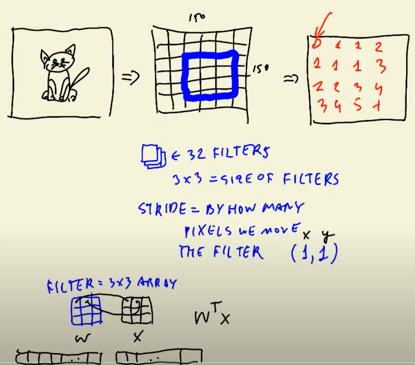

Additionally, in convolutional layers, ***padding*** is often used. _Padding_ is adding additional rows and columns of zeros evenly around the input image, making it possible for the filter to center on the egde and corner pixels of the image.

There are more additional hyperparameters such as ***dilation***, but they are much less common.

## RMSE for regression models in Keras

Accuracy is the standard metric for network performance in Keras, but for regression problems you may prefer to use RMSE instead. You will have to manually include the metric when compiling the model, like so:

    loss = keras.losses.MeanSquaredError()
    rmse = keras.metrics.RootMeanSquaredError()

    model.compile(optimizer=optimizer, loss=loss, metrics=[rmse])

## Sequential model

In the [final model section](#final-model) we used _functional style coding_ to define our network using Keras' Functional API.

Alternatively, you can use ***sequential style***. Sequential style makes use of Keras' Sequential model, which is a simpler, straight-forward way of creating networks.

```python
model = keras.models.Sequential()

model.add(Dense(64, activation='relu'))
model.add(Dense(1, activation='sigmoid'))
```

* We first instantiate a `Sequential` class object.
* We then add our layers to the model in order, starting from the input layer to the ouput.
* `Sequential` does not need an `Input` object to specify the inputs; it's inferred from the layers.

The Sequential model allows for very easy and quick model creation but is limited to single input, single output stacks of layers. It does not allow complex architectures and makes transfer learning more difficult. Using functional style might be trickier at the beginning but allows for more explicit complex network creation with clear layer order.

> Previous: [Midterm Project](../07_midterm_project/README.md)
>> Extra: [Midterm Project Tips & Tricks](07_misc.md)

> [Back to Index](README.md)

> Next: [Serverless Deep Learning](09_serverless.md)