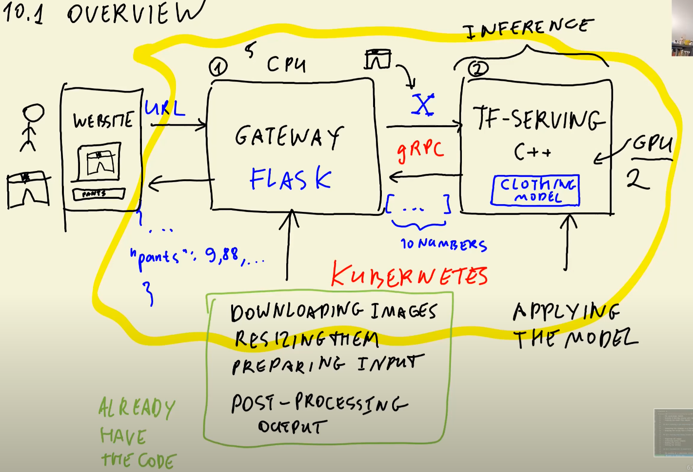
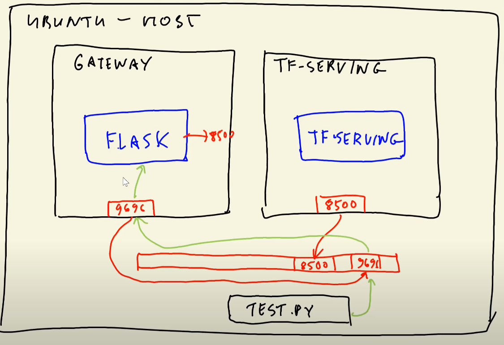
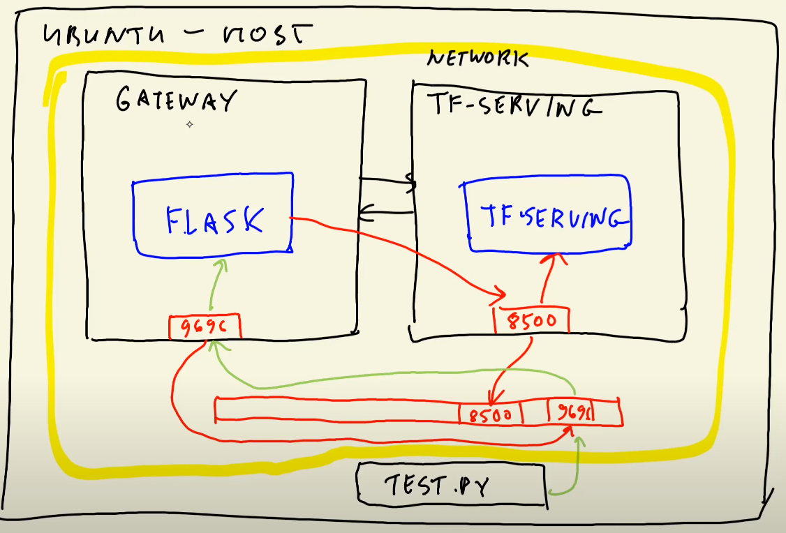
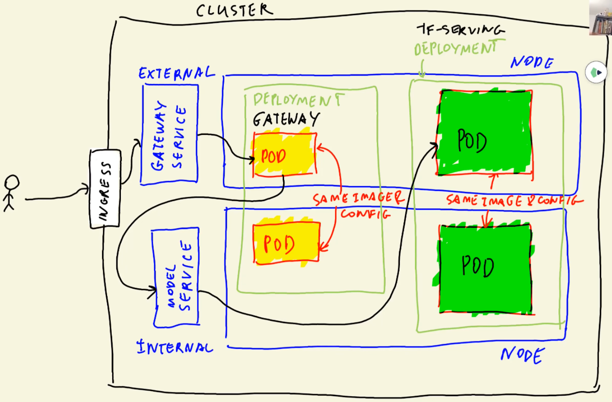

> Previous: [Serverless Deep Learning](09_serverless.md)

> [Back to Index](README.md)

> Next: _(Coming soon)_

# Kubernetes and TensoFlow-Serving overview



***Kubernetes*** is a _container orchestration system_ used to automatically deploy, scale and operate containers.

In this lesson we will use Kubernetes along with ***TensorFlow Serving***, a component of the TensorFlow Extended (TFX) family of technologies used to deploy models in production environments.

In the image above you can see the main architecture we will create during the lesson. The _gateway_ will be created with Flask and will take care of downloading images, resizing them, preparing the input for the models and post-process the model outputs. The _model server_ will be used for inference only and will receive for input an image in the form of a numpy array and will return a prediction using `gRPC` to the gateway.

The gateway only uses CPU computing and needs less resources than the model server, which makes use of GPU computing. By decoupling these 2 components, we can run them in separate containers and in different numbers (for example, 5 gateway containers and 2 model server containers, as shown in the image), allowing us to optimize resources and lower deployment costs.

# TensorFlow-Serving

## Model format and signature definition

TensorFlow Serving (`tf-serving`) requires models to be in a specific format.

```python
import tensorflow as tf
from tensorflow import keras

model = keras.models.load_model('original_model.h5')

tf.saved_model.save(model, 'converted_model')
```

This code loads a Keras model and simply saves it to Tensorflow format rather than Keras.

Tensorflow-formatted models are not single files; they are directories containing a number of files. Here's an example model directory structure:

```
converted_model
┣╸ assets
┣╸ saved_model.pb
┗╸ variables
    ┣╸ variables.data-00000-of-00001
    ┗╸ variables.index
```

The `saved_model_cli` utility allows us to inspect the contents of the tf model:
* `saved_model_cli show --dir converted_model --all`

We're specifically interested in the ***signature definition*** of the model. The signature definition describes both the inputs and the outputs of the model. Here's an example of signature definition:

    signature_def['serving_default']:
        The given SavedModel SignatureDef contains the following input(s):
            inputs['input_8'] tensor_info:
                dtype: DT_FLOAT
                shape: (-1, 299, 299, 3)
                name: serving_default_input_8:0
        The given SavedModel SignatureDef contains the following output(s):
            outputs['dense_7'] tensor_info:
                dtype: DT_FLOAT
                shape: (-1, 10)
                name: StatefulPartitionedCall:0
        Method name is: tensorflow/serving/predict

> WARNING: the output of `saved_model_cli` contains many more things than the signature which can be easily mixed. Make sure that you're looking at `signature_def['serving_default']` rather than `signature_def['__saved_model_init_op']`

In the signature above we can see that our example model has 1 input called `input_8` and 1 output called `dense_7`. Both of these names as well as the name of the signature definition (in our example, `serving_default`) are necessary for the next step.

## Running a container with a tf-serving model

TensorFlow-Serving has an official Docker image ready for deployment. By using ***volumes*** (folders in the host machine that can be mounted to containers in a manner similar to external storage) we can deploy our model in a volume and attach it to a container without the need to rebuild a new image, thus reducing the size of the Docker image and therefore reducing costs.

We can run the official tf-serving Docker image with our model mounted in a volume with the following command:

```sh
docker run -it --rm \
    -p 8500:8500 \
    -v "$(pwd)/converted_model:/models/converted_model/1" \
    -e MODEL_NAME="converted_model" \
    tensorflow/serving:2.7.0
```

* `-it`: short for `-i -t`
    * `-i`: interactive mode
    * `-t`: open a terminal
* `--rm`: when the interaction with the container ends, using this flag means that the container will be deleted.
* `\`: allows to escape the Enter key and create multi-line shell commands.
* `-p 8500:8500`: maps port 8500 in the host to 8500 in the container. We use the port 8500 because the official tf-serving image uses it.
* `-v "$(pwd)/converted_model:/models/converted_model/1"`
    * `-v`: volume. Maps a folder in the host (first half of the path) to a folder within the container (second half).
    * Both folder paths need to be absolute, so relative paths like `"./converted_model"` won't work. We can use a convenient trick with the `pwd` command to print our current folder: `$(pwd)` will be replaced with the current folder of the host machine.
    * The path to the container folder ends with a version number. If no version number is provided the `docker run` command will fail. You can just put `/1` all the time if you have other means of controlling model versions.
* `-e MODEL_NAME="converted_model"`: environment variable. The image makes use of an environment variable called `MODEL_NAME` which must match the name of our model.
* `tensorflow/serving:2.7.0` is the Docker image we will we using.

## Testing the tf-serving container with Jupyter Notebook (gateway)

With the Docker container running, we can now test it from a Jupyter Notebook.

```python
!pip install grpcio==1.42.0 tensorflow-serving-api==2.7.0
!pip install keras-image-helper

import grpc
import tensorflow as tf
from tensorflow_serving.apis import predict_pb2
from tensorflow_serving.apis import prediction_service_pb2_grpc

host = 'localhost:8500'
channel = grpc.insecure_channel(host)
stub = prediction_service_pb2_grpc.PredictionServiceStub(channel)
```

tf-serving makes use of gRPC, a framework for connecting services in and across datacenters. gRPC uses _Protocol Buffers_ (AKA ***Protobuf***) for formatting data, a kind of binary encoding which is faster and more efficient than JSON.

gRPC can establish both insecure and secure communication channels. Secure channels can make use of authentication and other advanced security features, but since our model server won't be accessible from the outside, insecure channels are adequate for our use case.

The _stub_ is our interface with the tf-serving in order to make inference with our model. It needs a channel as a parameter to establish the communication. 

```python
from keras_image_helper import create_preprocessor

preprocessor = create_preprocessor('xception', target_size=(299, 299))
url = 'http://bit.ly/mlbookcamp-pants'
X = preprocessor.from_url(url)
```

This is the same kind of code seen in [lesson 9](09_serverless.md) for transforming the image into a numpy array that our model can process.

```python
def np_to_protobuf(data):
    return tf.make_tensor_proto(data, shape=data.shape)

pb_request = predict_pb2.PredictRequest()
pb_request.model_spec.name = 'converted_model'
pb_request.model_spec.signature_name = 'serving_default'
pb_request.inputs['input_8'].CopyFrom(np_to_protobuf(X))
```

We can now set up our request to our model by instancing a Protobuf request object and defining its model name, the model's signature name that we saw before and its input.

For the input, note that we make use of the input name that we found in the signature. We also convert the numpy array of our image to Protobuf format and copy it to the request object.

```python
pb_response = stub.Predict(pb_request, timeout=20.0)

pb_response.outputs['dense_7'].float_val
```

Inference is done with the stub's `Predict()` method. We pass out request object as a parameter and define a timeout as well.

The `Predict()` method returns a Protobuf response object. We can access our predictions with the name of the output that we found in the signature definition. `float_val` returns the predictions as a regular Python list, so there is no need to do additional conversions.

```python
classes = [
    'dress',
    'hat',
    #...
    'pants'
]

dict(zip(classes, preds))
```

This code is just a convenience to tag each prediction value to the class they belong to.

Incidentally, this Jupyter Notebook code will be the basis for our gateway Flask app.

# Creating a pre-processing service (gateway)

Remember that you can export a Jupyter Notebook to a Python script with the following command:

```sh
jupyter nbconvert --to script notebook.ipynb
```

This command will output a `.py` file with the same name as the notebook.

We can rename the script to `gateway.py`, clean it up, organize the code in methods and add a `if __name__ == '__main__'` statement in order to convert the script to a Flask app.

>Note: a Flask cheatsheet is available [in this gist](https://gist.github.com/ziritrion/9b80e47956adc0f20ecce209d494cd0a)

There is one issue: in the notebook we defined the following function:

```python
def np_to_protobuf(data):
    return tf.make_tensor_proto(data, shape=data.shape)
```

The `make_tensor_proto()` method is a TensorFlow method and TensorFlow is a huge library about 2GB in size. A smaller `tensorflow-cpu` library exists but it still is over 400MB in size.

Since we only need to use that particular method, we can instead make use of a separate [`tensorflow-protobuf`](https://github.com/alexeygrigorev/tensorflow-protobuf) package which is available on pip.

```python
!pip install tensorflow-protobuf==2.7.0
```

The [GitHub page for `tensorflow-protobuf`](https://github.com/alexeygrigorev/tensorflow-protobuf) contains info on how to replace the `make_tensor_proto()` method.

Since the additional code is wordy, it would be convenient to define the `np_to_protobuf()` method on a separate `proto.py` script and then import it to the gateway app with `from proto import np_to_protobuf`.

# Running everything locally with `docker-compose`

Now that we've created our gateway, it's time to dockerize it and run both the model and gateway concurrently locally.

## Preparing the images

### Model image

[The `docker run` command we used for the tf-serving container](#running-a-container-with-a-tf-serving-model) is very long. If the volume and environment variable won't change often, we can create a new Dockerfile specifying them for easier deployment.

```dockerfile
FROM tensorflow/serving:2.7.0

COPY converted_model /models/converted_model/1
ENV MODEL_NAME="converted_model"
```

This dockerfile will copy the model to the image.

Asuming we name this dockerfile as `image-model.dockerfile`, we can build it with the following command:

```sh
docker build -t zoomcamp-10-model:v1 -f image-model.dockerfile .
```

>Note: check the [Docker cheatsheet](https://gist.github.com/ziritrion/1842c8a4c4851602a8733bba19ab6050#docker) for a `docker build` command refresher

We can now run this new image like this:

```sh
docker run -it --rm \
    -p 8500:8500 \
    zoomcamp-10-model:v1
```

With this new image running, it'd be a good idea to check whether or not the gateway can connect to it by running the gateway notebook we defined previously.

### Gateway image

The dockerfile for the gateway will have to include the dependency management files, the gateway script (as well as the `proto.py` script if you have one) and will have to define an entrypoint using a WSGI HTTP server such as `gunicorn`.

Here's an example `image-gateway.dockerfile` using `pipenv` for dependency management:

```dockerfile
FROM python:3.8.12-slim

RUN pip install pipenv

WORKDIR /app

COPY ["Pipfile", "Pipfile.lock", "./"]

RUN pipenv install --system --deploy

COPY ["gateway.py", "proto.py". "./"]

EXPOSE 9696

ENTRYPOINT ["gunicorn", "--bind=0.0.0.0:9696", "gateway:app"]
```

Build the dockerfile like this:

```sh
docker build -t zoomcamp-10-gateway:v1 -f image-gateway.dockerfile .
```

And now run it:

```sh
docker run -it --rm \
    -p 9696:9696 \
    zoomcamp-10-gateway:v1
```

## Testing the images

With both images running, we can now test them with a simple script:

```python
import requests

url = 'http://localhost:9696/predict'

data = {'url': 'http://bit.ly/mlbookcamp-pants'}

result = requests.post(url, json=data).json()
print(result)
```

However, this script will fail. If we check the Docker logs for the gateway container, you'll see a `status = StatusCode.UNAVAILABLE` error along with `details = "failed to connect to all addresses"`. In other words: the gateway service is trying to reach the model service but fails to do so.

## Connecting Docker containers with `docker-compose`

The reason that the test script fails is because the gateway service is trying to connect to port 8500 to reach the model service in localhost (which is actually the container itself), but the port 8500 inside the gateway service container isn't connected to anything. Both containers are connected to the host machine, but since the containers are not connected bewteen them, they are effectively isolated from each other, as the image below shows.



In order to fix this issue, both containers must be ***in the same network***. Placing both containers in a (virtual) network will allow them to connect to each other, thus allowing our test script to run successfully.



We can create this network with the `docker` command; however, it's a very tedious process. We can use the `docker-compose` command instead, which is used to run multi-container Docker applications and simplifies connecting different containers between them.

Instructions to install `docker-compose` [are available here](https://docs.docker.com/compose/install/).

## Running and testing the final app

`docker-compose` makes use of `yaml` files to define multi-container applications. The default file that `docker-compose` looks for is called `docker-compose.yaml`, similar to how `docker` looks for the default `Dockerfile` file.

The file defines which containers we should run and a few additional settings; `docker-compose` takes care of setting up the virtual network and connect the containers.

However, before we define the `docker-compose.yaml` file, we need to modify the gateway slightly. Currently, the connection to the model service is hardcoded as `host = 'localhost:8500'`; we can use environment variables instead to get the host address.

```python
# in gateway.py
# after all the library imports
import os

host = os.getenv('TF_SERVING_HOST', 'localhost:8500')
# rest of the code below
```

* The `os` module exposes operating system functionality, including environment variables.
* `os.getenv()` looks for the environment variable in the first parameter (`TF_SERVING_HOST` in our case). If the varaible cannot be found, the default value is the second parameter (the previously hardcoded `localhost:8500`, useful for local testing).

We now need to rebuild the gateway container.

```sh
docker build -t zoomcamp-10-gateway:v2 -f image-gateway.dockerfile .
```
> Notice the updated tag! This is now gateway image version 2.

Finally, here's what out `docker-compose.yaml` file would look like:

```yaml
version: "3.9"
services:
    model-server:
        image: zoomcamp-10-model:v1
    gateway:
        image: zoomcamp-10-gateway:v2
        environment:
            - TF_SERVING_HOST=model-server:8500
        ports:
            - "9696:9696"
```

* The `version` is just something required by the `docker-compose` standard in order to know which Docker engine version to use.
* Our app has 2 components: the gateway and the model. We define these 2 components inside `services`:
    * `model-server` is the name we've defined for our tf-serving container.
    * `gateway` is the name for the gateway container.
* No additional configuration is required for `model-server` other than the image name.
* `gateway` requires the following info:
    * `environment` is the environment variable that we define in order for the gateway to find the model.
    * `ports` is the port mapping necessary to connect to the Docker app from the outside.
* `docker-compose` makes use of the _service names_ that we define in order to connect the the containers. The gateway needs to connect to the model; we named the model container as `model-server`, thus we use this name as the value for the environment variable that we pass to the gateway, allowing the gateway to find the model inside the network that `docker-compose` creates.

We can now run the app like this:

```sh
docker-compose up
```
> Important: this command will only work when run from within the same directory where the `docker-compose.yaml` file is located.

Alternatively, we can also run in detached mode:

```sh
docker-compose up -d
```

This will escape the docker-compose output and return us to the terminal prompt. We can shut down the app with:

```sh
docker-compose down
```

With the app running, we should now be able to run the test script successfully.

# Intro to Kubernetes

As mentioned in the beginning of the lesson, Kubernetes is a technology that allows us to automatically deploy, scale and operate containers. In other words, it allows us to deploy the app we've created locally to the cloud and manage it.

A Kubernetes ***cluster*** contains ***nodes***, and nodes contain ***pods***. Pods are grouped in ***deployments*** along different nodes. Deployments are accessed through ***services***. The ***ingress*** is the entry point to the cluster.



* A _cluster_ is a Kubernetes deployment.
* A _node_ is a _server_ such as a local computer or an EC2 instance. Every cluster contains at least one node.
* A _pod_ is a group of one or more containers with shared storage and network resources, as well as a specification for how to run the containers.
* A _deployment_ is a group of pods all running the same image and config. The pods may be distributed in different nodes.
* A _service_ is a sort of entrypoint that serves as a middleman between the user and the deployment: it receives the requests from the user and routes it to an available pod within the deployment, and then serves the reply to the user. The user may be a pod from a different deployment or an external application; therefore services may be **external** or **internal**, depending on whether the deployment needs to be accessed externally or it's an internal component of a bigger app.
    * External services are called ***load balancers***.
    * Internal services are called ***ClusterIP's***.
* The _ingress_ is the resource that exposes HTTP/HTTPS routes from outside the cluster to services within the cluster.

Kubernetes can also manage deployments by scaling up (starting pods) and down (removing pods) as the user load increases or decreases. This is handled by the ***HPA*** (_Horizontal Pod Autoscaler_).

>Note: We will not be dealing with neither HPA nor ingress in this course.

# Deploying a simple service to Kubernetes

Before deploying our docker-compose app, we will deploy a simpler app with Kubernetes. We will need 2 additional tools:
* `Kind`: this tool allows you to create a local Kubernetes cluster in your local computer.
* `kubectl` (pronounced _coob-control_): the Kubernetes command-line tool, used to run commands against Kubernetes clusters.

## Creating a simple ping application in Flask

For this example we will create a very basic Flask app that returns `PONG` when receiving a GET request on the `/ping` route.

```python
from flask import Flask

app = Flask('ping')

@app.route('/ping', methods=['GET'])
def ping():
    return "PONG"

if __name__ == "__main__":
    app.run(debug=True, host='0.0.0.0', port=9696)
```

>Note: your Python environment will need both `flask` and `gunicorn` to run this app.

We will now create the Dockerfile for this ping app.

```dockerfile
FROM python:3.8.12-slim

RUN pip install pipenv

WORKDIR /app

COPY ["Pipfile", "Pipfile.lock", "./"]

RUN pipenv install --system --deploy

COPY "ping.py" .

EXPOSE 9696

ENTRYPOINT ["gunicorn", "--bind=0.0.0.0:9696", "ping:app"]
```

Build the image:

```sh
docker build -t ping:v1 .
```

>**IMPORTANT**: `docker build` will automatically apply the tag `latest` to the image when no tag is specified. In the following sections we will use Kind, a tool that won't accept the `latest` tag for images, so we need to tag our image with a tag of our liking, such as `v1` in this example.

Run the image:

```sh
docker run -it --rm -p 9696:9696 ping:v1
```

Finally, test it with `curl` on a terminal:

```sh
curl localhost:9696/ping
```

You should see `PONG` as the response from the app in the terminal.

## Installing kubectl

`kubectl` is the Kubernetes command-line tool used to run commands against Kubernetes clusters.

Installation instructions for all major platforms are available in the [official Kubernetes website](https://kubernetes.io/docs/tasks/tools/).

>Note: Docker Desktop for both Windows and MacOS already includes `kubectl`.

The goal of the lesson is to deploy our app to EKS, AWS' Kubernetes service. AWS also distributes `kubectl`; installation instructions from AWS [can be found here](https://docs.aws.amazon.com/eks/latest/userguide/install-kubectl.html). According to the EKS website, the Amazon distributed `kubectl` binaries are identical to the official ones.

## Setting up a local Kubernetes cluster with Kind

Kind is a tool that will allow us to create a local Kubernetes cluster in our computer for learning and developing.

Installation instructions are available [on the official website](https://kind.sigs.k8s.io/docs/user/quick-start/).

Once Kind is installed, create a cluster with the following command (it may take a few minutes):

```sh
kind create cluster
```

Once the cluster is created, in order to access it with `kubectl` we need to provide the kind cluster context to it. You may do so with the following command:

```sh
kubectl cluster-info --context kind-kind
```

You may know use `kubectl` to access the cluster. Try the following commands:

*   ```sh
    kubectl get service
    ```
    * It should return a single entry named `kubernetes`.
*   ```sh
    kubectl get pod
    ```
    * It should return `No resources found in default namespace.`
*   ```sh
    kubectl get deployment
    ```
    * It should return `No resources found in default namespace.`
*   ```sh
    docker ps
    ```
    * It should show a container running the `kindest` image, along with any other containers you might be running.

Kind makes use of Docker to simulate a cluster, which is why `docker ps` shows a container.

## Creating a deployment

Deployments in Kubernetes are defined with YAML files. Here's an example `deployment.yaml` file for our ping app:

```yaml
apiVersion: apps/v1
kind: Deployment
metadata:
    name: ping-deployment
spec:
    replicas: 1
    selector:
        matchLabels:
            app: ping
    template:
        metadata:
            labels:
                app: ping
        spec:
            containers:
            -   name: ping-pod
                image: ping:v1
                resources:
                    limits:
                        memory: "128Mi"
                        cpu: "500m"
                ports:
                -   containerPort: 9696
```

* The `.metadata.name` field contains the name of the deployment. In our example, `ping-deployment`.
* The `.spec.replicas` field states how many pods should be replicated in the deployment. In our example, we will only deploy 1 pod.
* The `.spec.selector` field defines how the deployment finds which pods to manage. There are a few different selection rules available.
    * In our example, the `.spec.selector.matchLabels` field selects a label defined in the _pod template_ ( `app: ping` ).
* The `template` field contains a number of sub-fields:
    * The `.metadata.labels` field states how pods are labeled; .in our example, `app: ping` .
    * The `.template.spec` field is the _pod template's specification_, which states that the pods run a single container ( `ping-pod` ) running the `ping:v1` image we created before.
        * The `resources` field specifies how many resources should the pods make use of. In this example, each pod will take a maximum of 128 MiB of RAM memory and will take _"500 miliCPU's"_ of CPU time; in other words, half of a CPU core's available time.

Before we run the deployment, we need to _load_ our image into our cluster nodes.

```sh
kind load docker-image ping:v1
```

We can now _apply_ our `deployment.yaml` file to our cluster:

```sh
kubectl apply -f deployment.yaml
```

>Note: you can check the status of your cluster by using the `kubectl get deployment` and `kubectl get pod` commands we saw before. In case of errors, you can get additional info from pods by using the `kubectl describe pod pod-name-taken-from-get-pod | less` command.

Finally, we test that the deployment is working as intended. We can do so with ***port forwarding*** in order to access the pod.

```sh
kubectl port-forward pod-name-taken-from-get-pod 9696:9696
```

This command will temporarily forward the port of the pod so that we can access it from outside the cluster. You can stop the port forwarding by pressing `Ctrl+C` on your keyboard.

With the port forwarding running, run the same `curl` command from before:

```sh
curl localhost:9696/ping
```

You should get a `PONG` response from the cluster.

## Creating a service

We now need to offer permanent access from outside the cluster with a service. Services are also declared with YAML files.

Here's an example `service.yaml` file for our ping app:

```yaml
apiVersion: v1
kind: Service
metadata:
    name: ping-service
spec:
    type: LoadBalancer
    selector:
        app: ping
    ports:
    -   port: 80
        targetPort: 9696
```

* The service will be named `ping-service` as stated on the `.metadata.name` field.
* The `ping-service` service will target the port 9696 of any pod with the `app=ping` label.
* The service will be external, AKA of `LoadBalancer` type. If this field is not specified, the default type would be `ClusterIP` (internal service).
* We can access the service on port 80.

With the `service.yaml` file created, we can now deploy it:

```sh
kubectl apply -f service.yaml
```

You can now check the state of the service with `kubectl get service` and test it with the `curl` command.

* ***IMPORTANT***: when checking the service status, you will most likely find that the LoadBalancer service we created has `<pending>` as its external IP value. We did not configure our cluster to assign IP's to LoadBalancers, so you will have to make use of port forwarding for testing.
*   ```sh
    kubectl port-forward service/ping-service 8080:80
    ```
* We use 8080:80 because port 80 locally is reserved for HTTP and would probably require root access to be changed, so we use port 8080 for the local port
*   ```sh
    curl localhost:8080/ping
    ```

# Deploying TensorFlow models to Kubernetes

## Deploying the TF-Serving model
## Deploying the Gateway
## Testing the service
# Deploying to EKS

> Previous: [Serverless Deep Learning](09_serverless.md)

> [Back to Index](README.md)

> Next: _(Coming soon)_