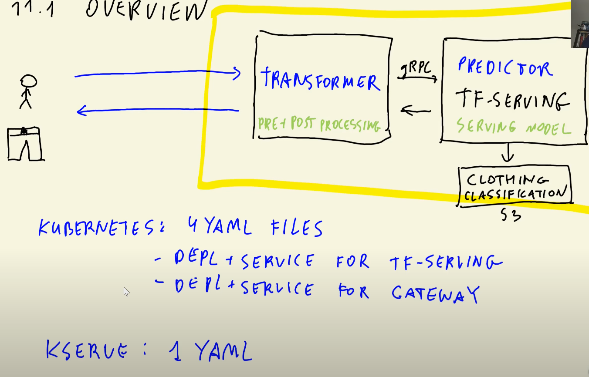

# Introduction to KServe

***[KServe](https://github.com/kserve/kserve)*** provides a Kubernetes _Custom Resource Definition_ for serving ML models on arbitrary frameworks.

A Kubernetes _Resource Definition_ is a YAML file that defines a _resource_ such as a deployment or a service, as seen in [lesson 10](10_kubernetes.md). Kubernetes allows creating new types of resources for additional abstraction.

In other words: KServe simplifies the deployment of Kubernetes apps by using shorter custom YAML files that take care of much of the work for us: with plain Kubernetes we needed 4 separate YAML files for our 2-component app, but with KServe we will only need 1. KServe works with many ML frameworks such as TensorFlow, PyTorch, XGboost, etc.

KServe used to be called _KFServing_ and be part of a bigger toolkit called [Kubeflow](https://www.kubeflow.org/) but it's become an independent project. Kubeflow is a toolkit for managing the complete ML lifecycle from development to deployment on top of Kubernetes, but KServe only focuses on serving models.

KServe is structured around apps being designed with a ***two tier architecture***. In other words; apps served with KServe must have 2 main components: ***transformers*** and ***predictors***, which fulfill similar roles to our gateway and model server from the previous lesson.



# Running KServe locally

## Installing Kserve locally

In order to run Kserve locally you will need to [install Kind](https://kind.sigs.k8s.io/docs/user/quick-start/) as well as [install kubectl](https://kubernetes.io/docs/tasks/tools/). If you followed [lesson 10](10_kubernetes.md) you should already have both.

You can install the Kserve Quickstart environment by [following the instructions in this link](https://kserve.github.io/website/0.7/get_started/). Make sure that a local Kind cluster is running before installing Kserve. The installation process will take several minutes.

>IMPORTANT: Kserve is installed on top of a cluster. Whenever you create a new one you will have to install Kserve on top of it.

## Deploying an example model

Once Kserve has been successfully installed, you may follow [these steps](https://kserve.github.io/website/0.7/get_started/first_isvc/) to install and test an example service.

Here's the test `iris-example.yaml` file:

```yaml
apiVersion: "serving.kserve.io/v1beta1"
kind: "InferenceService"
metadata:
  name: "sklearn-iris"
spec:
  predictor:
    sklearn:
      storageUri: "gs://kfserving-samples/models/sklearn/iris"

```

* The `kind` field is `InferenceService`, a custom resource that Kserve provides.
* `metadata.name` contains the name of the `InferenceService` (_`isvc`_ for short).
* `spec` contains the actual content of the file:
    * `predictor` is the Kserve component defined in the file, which will serve our model and output the predictions.
    * `sklearn` is the runtime we use for this particular model. We specify it here in order to let Kserve know how to handle the model internally. A list of available runtimes is available [here](https://kserve.github.io/website/0.7/modelserving/v1beta1/serving_runtime/).
    * `storageUri` links to the model (not a Docker image, but the actual model file!). The example file links to an example model hosted on Google Cloud, thus the `gs` scheme (_Google Storage_).

We can now apply the isvc resource:

```sh
kubectl apply -f iris-example.yaml
```

Let's now list all the available instances of `InferenceService`:

```sh
kubectl get inferenceservice
# or alternatively,
kubectl get isvc
```

If the isvc was successfully applied, it should display the state `READY = True` and display a public URL.

The public URL always follows the following pattern:

```sh
http://${SERVICE_NAME}.${NAMESPACE}.${DOMAIN}
```

In our example, since we didn't specify a namespace, the URL will be `http://sklearn-iris.default.example.com`

Kserve makes use of [Istio](https://istio.io/), a [_service mesh_](https://www.redhat.com/en/topics/microservices/what-is-a-service-mesh) that adds additional networking and monitoring capabilities to Kubernetes. When creating the InferenceService, Kserve (by means of Istio) created an _ingress service_, a public-facing load balancer for the app. You should see a `istio-ingressgateway` LoadBalancer service when typing the following command:

```sh
kubectl get service -n istio-system
# The istio-ingressgateway should be listed along with additional services
```

We have to specify the namespace `istio-system` in order to list the ingress; thus the `-n istio-system` part of the command.

The external IP will most likely be `<pending>` because we haven't configured Kubernetes to provide an external load balancer for the ingress gateway. However, we can make use of port forwarding to check whether the app is working or not:

```sh
kubectl port-forward -n istio-system service/istio-ingressgateway 8080:80
```

Now let's prepare a `iris-input.json` test input file:

```json
{
  "instances": [
    [6.8,  2.8,  4.8,  1.4],
    [6.0,  3.4,  4.5,  1.6]
  ]
}
```

This request has 2 observations, so we expect 2 predictions.

Since we do not have DNS, we will curl with the ingress gateway external IP using the HOST Header:

```sh
curl -v -H "Host: ${HOST}" ${URL} -d @./iris-input.json
```
* `${HOST}` is the `sklearn-iris.default.example.com` URL we got from using `kubectl get isvc`.
    * We don't have access to `example.com` but Kserve still needs to know it because it needs to be able to know which InferenceService we want to send the request to (imagine we had several isvc's in our cluster; when the ingress gateway receives the request it needs to know where to send it!).
* `${URL}` is the actual external URL of the InferenceService in our hosted Kubernetes which we need to send the predict request to. If you're running Kubernetes on localhost, it will have the following format:
    * `http://localhost:8080/v1/models/${SERVICE_NAME}:predict`
    * Remember that ${SERVICE_NAME} in our particular case is `sklearn-iris`.
    * `localhost` is our `INGRESS_HOST` and `8080` is our `INGRESS_PORT`.
    * `${SERVICE_NAME}` is `sklearn-iris`.
    * In Kserve, the convention is to use a colon (`:`) to separate the path from the URL, which is why we have 
* In `curl`, we can specify an HTTP header with the `-h` option. We use it to send the Host info for the Ingress Gateway to know which isvc needs to receive the user's request.
* `-v` is the verbose option. You may omit it if you want.
* `-d` specifies that the data we want to send is inside a file.

You should receive something like this:

```sh
{"predictions": [1, 1]}
```

Alternatively, you can also use a python file to send a request instead of using `curl`:

```python
import requests

service_name = 'sklearn-iris'
host = f'{service_name}.default.example.com'
actual_domain = 'http://localhost:8080'
url = f'{actual_domain}/v1/models/{service_name}:predict'

headers = {
    'Host': host
}

request = {
    "instances": [
      [6.8,  2.8,  4.8,  1.4],
      [6.0,  3.4,  4.5,  1.6]
    ]
  }

response = requests.post(url, json=request, headers=headers)

print(response.json())
```

# Deploying a Scikit-Learn model with KServe

In the previous block we already deployed an example Scikit-Learn model, but in this block we will train a new model and deploy it to explore the specifics.

## Training the churn model with a specific Scikit-Learn version

We will make use of the [churn model we saw in lesson 5](https://github.com/alexeygrigorev/mlbookcamp-code/blob/master/course-zoomcamp/05-deployment/code/05-train-churn-model.ipynb).

Kserve includes a _Scikit-Learn Server_ component that requires a specific Scikit-Learn library and Python versions. [In this folder of the Kserve repo](https://github.com/kserve/kserve/tree/master/python) you will find the [`sklearn.Dockerfile`](https://github.com/kserve/kserve/blob/master/python/sklearn.Dockerfile) that contains the Python version we need (Docker image `python:3.7-slim` at the time of writing these notes), and [in the folder for the `sklearnserver`implementation](https://github.com/kserve/kserve/tree/master/python/sklearnserver) you will wind the [`setup.py`](https://github.com/kserve/kserve/blob/master/python/sklearnserver/setup.py) that contains the dependencies we need, which at the time of writing are:
* `kserve` 0.7.0
* `scikit-learn` 0.20.3
* `joblib` 0.13.0

We will use Conda to create a virtual Python environment with these library dependencies. Pipenv is good for managing library versions but trickier for Python versions, so we will use Conda in this instance:

```sh
conda create -n py37-sklearn-0.20.3 python=3.7 scikit-learn==0.20.3 pandas joblib
```
* We don't bother specifiying library versions for the other dependencies because they're not important in this case.

We will now train the churn model again within this new environment based on the [05-train-churn-model.ipynb](https://github.com/alexeygrigorev/mlbookcamp-code/blob/master/course-zoomcamp/05-deployment/code/05-train-churn-model.ipynb) Jupyter Notebook. We will export the notebook to a [`churn-train.py`](../11_kserve/churn/churn-train.py) file and make a few small changes:
* No need to import `train_test_split` nor `KFold`.
* We will read the data from a URL rather than a local file.
* No need to split the dataset; we will train on the whole dataset but we will only use the numerical features `tenure` and `monthlycharges`, and the categorical `contract`.
* We will use `joblib` rather than `pickle`. Import it and save the model with `joblib.dump()`.
    * The sklearn-server needs a specific name for the model. Save it as `model.joblib`.
*  The sklearn-server will only call the `predict()` method on our model but we need to fit a `DictVectorizer` as well as the model. We can use [sklearn's pipelines](07_misc.md#scikit-learn-pipelines) to fit both things within a single pipeline object that we can later dump as a file; that way sklearn-serve will call `predict()` on our pipeline and fit the vectorizer as well as the model.

Activate the environment and run the script to save the model. You may now deactivate the environment since we won't be using it anymore.

## Deploying the churn prediction model with KServe

We now need to create a `churn-service.yaml` InferenceService file:

```yaml
apiVersion: "serving.kserve.io/v1beta1"
kind: "InferenceService"
metadata:
  name: "churn"
spec:
  predictor:
    sklearn:
      storageUri: "http://172.31.13.90:8000/churn/model.joblib"
```

* We will call the isvc `churn` in `metadata.name`.
* In `spec.predictor.sklearn.storageUri` we need to provide a link to our model. You can upload it to a GitHub repo for convenience. In this example we use Python's built in web server to locally host the model and put the URL there.
    * In order to run Python's built-in web server, go to your model's directory on a terminal and run:
    * `python -m http.server`
    * The contents of the folder will be available on `http://localhost:8000`.
    * Kserve won't be able to make use of the `localhost` name to retrieve the model, so you will need to substituite it with the IP address of your machine. You can find it with `ifconfig`/`ipconfig`.
    * Find out more info about using storage URI's [in this link](https://github.com/kserve/kserve/tree/master/docs/samples/storage/uri).

Deploy the isvc:

```ssh
kubectl apply -f churn-service.yaml
```

Now let's test if the isvc deployed successfully with our model:
1. Get the pod name with `kubectl get pods` .
1. Check the logs of the pod with `kubectl logs <pod_name>` . At the end of the logs the line `Registering model: churn` should appear.
    * If the pod contains multiple containers, Kubernetes will complain and offer you a list of available containers. In this case, use `kubectl logs <pod_name> <container_name>` .
1. Now login to the pod:
    * `kubectl exec -it <pod_name> <container_name> --bash`
1. Navigate to the model directory with `cd mnt/models/` and check the contents with `ls` . The `model.joblib` file should be there.
1. Open a python interactive terminal with `python` and run the following lines:
```python
import joblib

model = joblib.load('model.joblib')

# get a few examples to run from the original dataset on a separate Notebook or whatever. You can also use these:
X = = [{'contract': 'one_year', 'tenure': 34, 'monthlycharges': 56.95}]

model.predict(X)
# you should get a binary prediction

model.predict_proba(X)
# you should get a prediction probability

exit()
```
Alternatively, you can also create a [`churn-test.py` file](../11_kserve/churn/churn-test.py) in a similar fashion to the script we created in the previous block as an alternative to `curl` and run it.

# Deploying custom Scikit-Learn images with KServe

We will now deploy a custom Scikit-Learn image with a newer library version which will return prediction probabilities rather than hard predicitons.

## Customizing the Scikit-Learn image

First, we need to download the [Kserve repository](https://github.com/kserve/kserve). You can download the zip file directly, you don't need to clone the repo (it should be about 35MB in size).

Unzip the file and move the folder to your project folder. Add the folder to the `.gitignore` file so that it's not added to your repo by accident.

Open the `kserve-master/python/sklearn.Dockerfile` and update the Docker image (first line of the Dockerfile) to `python:3.8-slim` . 

Now open the `kserve-master/python/sklearnserver/setup.py` and update the scikit-learn version to `1.0.1`.

Finally, open the `kserve-master/python/sklearnserver/sklearnserver/model.py` and modify it so that the `predict` method calls this line:

```python
result = self._model.predict_proba(inputs).tolist()
```

Let's build the Docker image. Go to the `kserve-master/python` folder and type the following command:

```sh
docker build -t kserve-sklearnserver:3.8-1.0 -f sklearn.Dockerfile .
```

* The name of the image and tag is up to you. This example uses the `kserve-sklearnserver` name along with the `3.8-1.0` tag (Python and scikit-learn versions respectively).
* You must build it from the `kserve-master/python` directory because the Dockerfile needs to copy some files and the paths must be the expected ones.
* Building this image may take a while.

We now have to retrain our model with the updated version of scikit-learn. You will have to create a new environment. You can use the same method as before; in this example we will use `pipenv` to handle the dependencies starting from a 3.8 Python base. Run the following commands from the directory in which you have your churn files:

```ssh
pipenv install scikit-learn==1.0.1 joblib pandas

pipenv run python churn-train.py
```

This should have created a new `model.joblib` file.  Let's now run the Docker image we created to test it:

```sh
docker run -it --rm \
  -v "$(pwd)/model.joblib:/mnt/models/model.joblib" \
  -p 8081:8080  \
  kserve-sklearnserver:3.8-1.0 \
  --model_dir=/mnt/models \
  --model_name=churn
```
* The docker container must have access to the model; instead of rebuilding the image, we mount a volume so that we don't have to rebuild the image.
* We map the port 8080 to 8081 in order to avoid conflicts with the local Kubernetes cluster.
* This specific image requires 2 additional parameters: `model_dir` and `model_name`. Otherwise, the python script at the entrypoint will complain and the container will not run.

You can use the [`churn-test.py` file](../11_kserve/churn/churn-test.py) from before to test the container. The output of the prediction should now be 2 sets of probabilities.

>Note: make sure that the test script is using the port 8081; otherwise it will not work. You van change it back to 8080 after the test because that's the port that Kserve uses.

## Running KServe service locally

We now need to update the `churn-service.yaml` service definition file:

```yaml
apiVersion: "serving.kserve.io/v1beta1"
kind: "InferenceService"
metadata:
  name: "churn"
spec:
  predictor:
    sklearn:
      image: agrigorev/sklearnserver:3.8-1.0-predict-proba
      storageUri: "http://172.31.13.90:8000/churn/model.joblib"
      resources:
        requests:
          cpu: 300m
          memory: 256Mi
        limits:
          cpu: 500m
          memory: 512Mi
```
* Under `spec.predictor.sklearn` we add an `image` field that points to our custom Docker image.
  * In order for Kserve to find our image we would have to add it to the _configmap_ and then specify a `runtimeVersion` field in the spec; instead we simply publish a Docker image to Docker Hub and use the `repo/image:tag` URI under `image`.
* We limit available resources in a similar way to pods in plain Kubernetes.

We can now apply the isvc with the usual:

```ssh
kubectl apply -f churn-service.yaml
```
* Don't forget to enable the Python http server! Kserve needs to be able to find the `model.joblib` file.

>Note: you can get rid of older isvc's with `kubectl delete isvc <isvc_name>`

Once that the isvc has been deployed, make sure that port forwarding is enabled:

```sh
kubectl port-forward -n istio-system service/istio-ingressgateway 8080:80
```

And finally run the test script. You should receive the same probabilities as before.

# Serving TensorFlow models with KServe

Deploying a TensorFlow isvc is similar to Scikit-Learn isvc's. We will use a Keras model from a previous lesson and convert it to TF.

## Converting the Keras model to saved_model format

We already saw in the previous lesson [how to convert Keras models to TF](10_kubernetes.md#tensorflow-serving). For brevity, we will describe the steps broadly:

1. Download a TF model by running this command:
    * `wget https://github.com/alexeygrigorev/mlbookcamp-code/releases/download/chapter7-model/xception_v4_large_08_0.894.h5`
1. Download or copy the `convert.py` script [from this link](https://github.com/alexeygrigorev/mlbookcamp-code/blob/master/chapter-09-kubernetes/convert.py) and save it to the same folder of the model.
1. Run the `convert.py` script.

A new `clothing-model` folder should appear.

>Note: the reason we're placing the contents of the model in that folder is because the TF-serving image expects it like this. See [the previous lesson](10_kubernetes.md#running-a-container-with-a-tf-serving-model) for details.

## Deploying the model

Kserve's TensorFlow InferenceService makes use of TF-serving, so we need to prepare the model accordingly.

1. Go inside the `clothing-model` folder, create a new folder with the name `1` (the number one) and move all the other contents to this new folder.
1. Zip the contents of the `clothing-model` folder (in other words, the `1` folder) and name it `clothing-model.zip` .
1. Use `python -m http.server` to serve the contents of your work folder and copy the link to `clothes/clothing-model/clothing-model.zip`

Let's create a new `clothes-service.yaml` isvc file. Its contents will be very similar to the yaml file [from the previous section](#running-kserve-service-locally).

```yaml
apiVersion: "serving.kserve.io/v1beta1"
kind: "InferenceService"
metadata:
  name: "clothes"
spec:
  predictor:
    tensorflow:
      storageUri: "http://172.31.13.90:8000/clothes/clothing-model/clothing-model.zip"
      resources:
        requests:
          cpu: 500m
          memory: 256Mi
        limits:
          cpu: 1000m
          memory: 512Mi
```
* Inside `spec.predictor`, we exchange `sklearn` for `tensorflow`.
* We're using the default TF isvc image, so there is no need to specify a custom one.
* Remember that the URL for the model will be specific to you. Paste the link to the model zip file and change the IP address accordingly using `ifconfig`/`ipconfig` to find  out your IP address.
>Note: this file is for creating an InferenceService with HTTP. If you want to use gRPC, check the [instructions on the Kserve repo](https://github.com/kserve/kserve/tree/master/docs/samples/v1beta1/tensorflow#create-the-inferenceservice-with-grpc).

We can now deploy the isvc with the usual command:

```ssh
kubectl apply -f clothing-service.yaml
```

## Preparing the input

If you recall from the previous lesson, in order to send requests to a TF-serving model we first need to [preprocess the input with a gateway](10_kubernetes.md#testing-the-tf-serving-container-with-jupyter-notebook-gateway). We need to create a similar script in order to test the Kserve TF isvc because we don't have a _transformer_ yet (we'll cover transformers in the next block).

[Here's a Jupyter Notebook with the necessary code for testing](../11_kserve/clothes/test.ipynb).
* You will need a Python environment in which you've installed `keras_image_helper`.
   * You can install it with `pip install keras_image_helper`
* We only need to use the `keras_image_helper` library, so there is no need to import anything else.
    * We don't use gRPC in this deployment, only regular HTTP.
* We copy the `request` format from [the code we used in this block to send requests to the sklearn isvc](11_kserve.md#deploying-an-example-model) (scroll to the end of the block). 

Once that your test notebook is working correctly, you may [convert it to a python script](../11_kserve/clothes/test.py).

# KServe transformers

## Why do we need transformers

In an actual deployment we cannot expect our end users to use a script to preprocess the input images.

A ***transformer*** is a Kserve component that handles input preprocessing as well as output formatting before delivering it to the end user.

This section borrows heavily from [Kserve's official docs](https://github.com/kserve/kserve/tree/master/docs/samples/v1beta1/transformer/torchserve_image_transformer).

## Creating a service for pre and post processing

Just like with predictors, transformers are declared in the YAML file of the service. We will also need a script that handles the actual pre and post processing and we will dockerize it.

### Script

In order to create a Kserve transformer we need to create a class that derives from the base `kserve.Model` class and then overwrite the `preprocess` and `postprocess` methods.

Let's create a `image_transformer.py`:

```python
import kserve
from typing import List, Dict

class ImageTransformer(kserve.Model):
  def __init__(self, name: str, predictor_host: str):
    super().__init__(name)
    # URL for the model predict function
    self.predictor_host = predictor_host
    # ...

  def preprocess(self, inputs: Dict) -> Dict:
    result = []
    # ...
    return {'instances': result}

  def postprocess(self, inputs: Dict) -> Dict:
    result = []
    # ...
    return {'instances': result}
```

* We make use of [type hints](https://www.infoworld.com/article/3630372/get-started-with-python-type-hints.html) to declare the types of the method parameters and return values. This isn't actually necessary and does not change the results of the code but it can be useful in complex code bases because it provides metadata to the IDE when developing.
* The `self.predictor_host` is needed for the transformer in order to find the inference service. It's a URL that points to the service. Kserve handles the connection between the 2 components.

We will now adapt the contents of the [previous test.py script](../11_kserve/clothes/test.py) into `image_transformer.py`:

* Move the definition of the `classes` and `preprocessor` objects inside the `ImageTransformer` class constructor.
* Create an auxiliary `prepare_input()` method that receives an image URL, preprocesses it and returns the vectorized preprocessed image as a list:
    ```python
    def prepare_input(self, url: str) -> List:
      X = self.preprocessor.from_url(url)
      return X[0].tolist()
    ```
    * Note that we need to return a Python list! `X[0]` is a NumPy array, which is not serializable and will not work here!
* The `preprocess` method should loop throught the input images Dict, call the `prepare_input()` method on each image and append the result to the `result` list.
* The `postprocess()` method should zip each element in the `response` dict with its corresponding class and append it to the `result` list.

This transformer script will be dockerized and run with Kserve. The way Kserve expects transformers to work is by having the script served with a webserver, similar to what we did with Flask in previous lessons; however, Kserve already provides a webserver (Tornado) so there is no need to import additional libraries.

We will just add a `main` block at the end of the script:
```python
if __name__ == '__main__':
  import argparse

  # argument parsing
  parser = argparse.ArgumentParser(parents=[kserve.model_server.parser])
  parser.add_argument("--predictor_host", help="The URL for the model predict function", required=True)
  parser.add_argument("--model_name", help="The name of the model", required=True)

  args, _ = parser.parse_known_args()

  model_name = args.model_name
  host = args.predictor_host

  # transformer instancing
  tranformer = ImageTransformer(model_name, predictor_host=host)

  # webserver
  server = kserve.ModelServer()
  server.start(models=[tranformer])
```
* We use the `argparse` library to parse the arguments that the transformer will receive: the `predictor_host` URL and the `model_name`.
* We instantiate our transformer.
* We create a `kserve.ModelServer()` object and call its `start()` method passing the transformer instance as a parameter.

You can see a finalized script [in this link](../11_kserve/image_transformer/image_transformer.py).
>Note: the linked script uses the old `kserve.KFModel` and `kserve.KFServer()` calls but behaves identically to the new calls.

### Script local test

We now need to test the script. We will use pipenv to handle dependencies. With Kserve running and serving the model, run the following:
```sh
pipenv install kserve==0.7.0 keras-image-helper

pipenv shell

python image_transformer.py --predictor_host=localhost:8080 --model_name="clothes" --http_port=8081
```
* Even though we didn't declare the `http_port` argument in our script, it's one of the many default arguments provided by `kserve.ModelServer()`. You can find out which arguments are available by running the script without any arguments and reading the console output.
* Since istio is already running on port 8080, we need to run the transformer on a separate port. In this example we're using port 8081.

In order to test it we need to forward the port of the predictor pod because we're running the transformer from outside Kserve and istio won't be able to reroute our request.

Run the following:
```sh
# fin out the name of the predictor pod
kubectl get pod

# port forwarding
kubectl port-forward <pod_name> 8080:8080
```

We can now test the script. You can modify the original [`test.py`](../11_kserve/clothes/test.py) by getting rid of all image preprocessing and modifying the `request` dictionary so that the `instances` list contains another dictionary of URLs. Here's a finalized [`test-transformer.py` script](../11_kserve/image_transformer/test-transformer.py). Make sure that the domain you're targetting is `localhost:8081`.

Run the [`test-transformer.py` script](../11_kserve/image_transformer/test-transformer.py). You should receive predictions for 2 image URLs.

>Note: remember to remove the port forwarding and run `deactivate` on the terminal in which you run the transformer after you're finished testing.

### Docker image

We can now dockerize our script. The Dockerfile will be very similar to all other Dockerfiles we've created so far:

```dockerfile
FROM python:3.8.12-slim

RUN pip install pipenv

WORKDIR /app

COPY ["Pipfile", "Pipfile.lock", "./"]

RUN pipenv install --system --deploy

COPY "image_tranformer.py" .

ENTRYPOINT ["python", "image_tranformer.py"]
```

Build it as usual with `docker build`.

### YAML file

We now need to declare our transformer service within the spec of our isvc.

```yaml
apiVersion: "serving.kserve.io/v1beta1"
kind: "InferenceService"
metadata:
  name: "clothes"
spec:
  transformer:
    containers:
      - image: "<transformer_name>:<tag>"
        name: clothes-transformer
        resources:
          requests:
            cpu: 300m
            memory: 256Mi
          limits:
            cpu: 500m
            memory: 512Mi
  predictor:
    tensorflow:
      storageUri: "http://172.31.13.90:8000/clothes/clothing-model/clothing-model.zip"
      resources:
        requests:
          cpu: 500m
          memory: 512Mi
        limits:
          cpu: 1000m
          memory: 512Mi
```
* We add the `transformer` block right under `spec` and we specify the Docker image, the service name and optionally the resources that the transformer may take in the Kubernetes cluster.

However, the YAML file above ***will not work***. Kserve does not know how to load local images. We will have to push it to Docker Hub or any other repository and then use the image URI in the `image` field.

Here's a modified [`clothes-service.yaml` file](../11_kserve/image_transformer/clothes-service.yaml) that you can use that makes use of a preloaded transformer images. The YAML file includes a few additional environment variables because it can be use to transform images for multiple models; read more about it [in this link](https://github.com/alexeygrigorev/kfserving-keras-transformer).

### Apply the isvc

You are now ready to deploy the isvc. Run the following:

```sh
kubectl apply -f clothes-service.yaml
```

### Test the deployment

Forward the istio port:

```sh
kubectl port-forward -n istio-system service/istio-ingressgateway 8080:80
```

Run the [`test-transformer.py` script](../11_kserve/image_transformer/test-transformer.py) and make sure that you're pointing to `localhost:8080`. You should receive predictions.
# Deploying with KServe and EKS

## Creating an EKS cluster
## Installing KServe on EKS
## Configuring the domain
## Setting up S3 access
## Deploying the clothing model